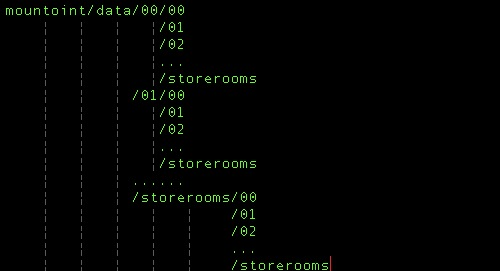
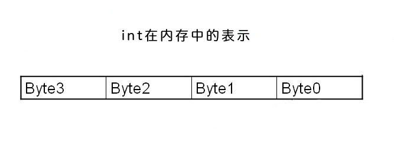

Title: 使用bit解决跳位问题
Date: 2014-09-04
Category: 技术
Tags: 技术 小技巧
Slug: bit
Author: spk xu
Status: published
Summary:使用二进制的玩法来解决目录的问题,觉得挺有意思,记录一下!

#### 背景
近期一直在做DFS的开发工作，在开发工作中碰到一个"跳目录"的问题。其实就是递增目录
的情况.  

具体是这样的，
首先我们的DFS（名字叫ydb，一下就称ydb吧。）也就是ydb会对每个配置的挂载点进行格
式化。这个格式化其实就是建立文件夹。文件夹的数量(一下简称storerooms）是可配置的，比如你可以配置成64
也可以配置成128或者任何一个你想要的数，但是最大不能超过256(其实是255，0-FF）.那么ydb就会对每个挂
载点进行一次storeromes*storerooms的文件夹建立，最后文件夹的呈现这样一个情况：  
  
在ydb中，每个文件夹保存的文件数也是可以配置的（配置项为storecount），只要文件
夹内的文件存储量达到storecount，那么下一个文件将会存入下一个文件夹，比如当前存
储在00/03文件夹，那么下一次就会存储到00/04，如果storerooms为256，那么如果当前
文件夹为00/FF，那么下一次将会01/00（其实就是会跳母文件夹）。  
其实就是这个跳文件夹的功能，怎么样才能解决问题？  

#### 解决方案
为了方便里面，我们把前面的p1设成母文件夹，p2设成子文件夹，就是这样p1/p2。  
##### 人类的代码
人类能理解的代码呢，基本上就是按部就班的解决这个问题，思路是这样的：  
1. 判断p2+1 是不是等于storerooms，如果没有，那就+1；  
2. 如果等于storerooms，那么p2归零，p1+1；  
3. 判断p1+1后是不是等于storerooms，如果不是，那么正常执行，如果是，那么p1，p2.  
全部归零，从头开始；或者根据mp的负载均衡配置，决定存储的mp。  
代码大概就是这样的；  

if(storerooms == p2 + 1){
    p2 = 0;
    if(storerooms == p1 + 1){
        p1 = 0 ;
        //insert get mp by storemode
    } else {
        p1 += 1;
    }
}else{
    p2 += 1;
}
    
这样勉强还算能看的下去，是吧？但是总归让人感觉不是很舒服，层级太多，判断太多了
，那么我们来一种计算机喜欢的方式。  
##### 计算机喜欢的代码
这里我们使用了一个技巧，就是char和int之间的关系。  
  
如上图，一个int在内存中是4个byte，一个byte的最大值正好是255.完全符合我们的
storerooms的最大值。那么也就是说p1,p2是一个int的2个byte(分别为
        p2->byte0,p1->byte1,flag->byte2)，而且如果我们的最大值
正好设定为255，那么我们连跳级都不用了，直接就已经内置了（因为p2达到255，再加1
，正好向p1加1，p2归0）。所以我们就有如下的算法：  

u32_t total = 0;
u8_t flag = 0;
total = p1 << 8 | p2;
total++;
flag = total >> 16 & 0xFF;
p1 = total >> 8 & 0xFF;
p2 = total & 0xFF;
if(c->storerooms == p2){
    p1++;
    p2 = 0;
}
if(c->storerooms == p1){
    flag = 1;
    p1 = 0;
}
    
解释一下：  
1. 首先，我们需要一个u32的临时变量，所有的数据都是在它内部变的；  
2. flag就是是不是需要重新获取mp或者说该mp下所有的目录都放满的标志；  
3. 把p1和p2根据位置压入u32的临时变量，然后直接对这个变量+1；  
4. 再把u32的变量分解成flag，p1和p2；  
5. 然后判断母子目录要不要跳；  
6. 最后根据flag，决定是否需要重新确定存储mp。

