Title: 架构忏悔录--Albianj的诞生之趣
Date: 2022-06-15
Category: 架构忏悔录
Tags: 架构忏悔录
Slug: arch-confessions-about-albianj
Author: spk xu
Status: published
Summary: 从头聊架构,第一趴必须是albianj.它诞生于无聊环境下的练练手,纯粹就是想试试看,看看我是不是也能写出来技术栈架构.同时java早就忘光的我开始第一行代码是一边看着书一边查阅API的状态,实打实的体验了"现炒现卖"的快感.以为这就是一个玩具,可能永远都不会付诸于实践,没成想最后竟撑起一个系统,这一篇,我们就聊一聊albianj.

## 缘起
2009年,一次倒霉后的幸运让我"误"入了互联网.在人生的第一家互联网公司(下文称"飞客在线"吧),见识到了对于技术的某些至高的需求和实现.在那个年代,互联网还不是一个"正统"的行业,虽然已经开始崭露头角,但IT业"正当"的工作还是进Microsoft,IBM,Oracle,甚至Infosys,Tata这种外包都比互联网优先级高.我第一家公司是做MIS系统的,受其影响,我印象和观念中,互联网这种模式就几个简单的网页,内部的业务逻辑简单到几乎不存在,剩下的还能有什么?一点技术含量都没有,而MIS和ERP复杂的业务才是考验人的地方.现在回过来看,真是无知者无畏的愣头青做派.

进入了互联网后,一切都和原来的做事方式不一样,一度无法适应的我差点准备离开,幸好还是被拦住了.适应后重新审视互联网,其实互联网对于技术的追求,特别是2C的业务对于快速,稳定近乎有苛刻的要求是如此的瞩目,就好像刻在DNA里一样.当时飞客在线一天的流水是2kw,每天晚上6点开始到凌晨2点是高峰期的高峰期,因为行业的特殊性,时效在飞客在线是非常非常重要的.所以对于发布的单子,购买方会在很短的时间内,通常就是几分钟内抢购完.这样的压力,几乎就是每天都是双十一的秒杀.当时我们说的最多的话就是:任何细微的错误在这些流量+钱+压力下都会被无限放大到足以杀死人.这样的需求和现实问题就要求我们必须有一个稳定的,高性能的,能应对大规模部署的,并且极具收缩性的框架方案.我们当时的CTO单人开挂,写了一个框架,名字叫aaf.没有开源,网上原有一些他本人写的文档 [aaf作者的blog](https://blog.csdn.net/aafshzj "94geek.com->aaf"),现在已经找不到了.我找了一些我原同事转发的,有兴趣可以看一下[aaf框架文档](https://www.cnblogs.com/zgx/category/183819.html "94geek.com->aff框架文档") .

飞客在线整站技术和业务都是基于aaf打造的,它确实抗住了流量山呼海啸般的冲击,也带来了坚若磐石的稳定性,至少能让我们开发者,维护者能开始睡一个好觉.更难能可贵的是,aaf的实现在那个时代是绝对的超前和领先的.他实现了当时最新概念,解决了最棘手技术问题,提供了方便维护和方便开发的功能.不过就算是再好的框架,再超前的概念,再灵活的设计都会随着时间的流逝,业务的变化,行业本身的发展变成桎梏,aaf也逃不出这个必然的规律.当时我就想(可能是我们当时很多同事都想),能不能改写aaf,让aaf跟上时代的发展.但是不开源,在公司内部也是闭源的状态,甚至更像是一个禁忌,大多数人对于aaf也是三缄其口.曾经也年轻气盛,当面和作者聊过关于aaf的事情,给到的答复也是:一般不讨论aaf.

## 念念不忘
后来因为各种原因离开了飞客在线,进入一家当年披着互联网外衣的"伪互联网公司"(下文成OTA).在OTA,虽然有所谓的架构部门,但基本没有任何的作用,也不知道他们在搞啥?架构,那可能只是在给领导汇报的PPT上.框架,偷懒式的使用Microsoft当年为.Net出的Enterprise Library,美其名曰:想把整个技术部上千号人整合在一个方向上.业务的逻辑还是封装在存储过程中,所以局面可能称之为"失控"比较恰当.在飞客在线的时候,总觉得公司的技术这几年没有特别大的提升.唯一的亮点在于打破了原本只基于windows这套体系的技术架构,我们(当时在飞客在线架构组任职)把Memcached落地了,引入了分布式文件系统来解决每天30G图片增量的问题.虽然原来的CTO离职了,当时aaf依然闭源,准确的说,当时好像还没人也能足够的能力去接手它,故步自封的遗憾导致了其跟不上时代给与的某些进步红利.虽然飞客在线有这有那的问题,但经历了OTA这么大的一个公司,技术这样也能跑的震撼,回想起飞客在线的技术,还真是印证了那句名言:谁曾想离开了才知道"牛夫人才是当初的小甜甜",新人胜旧人并不是千古不变的永恒.

经历两家完全不同的公司,我亲眼见到了一家公司一个团队在有和没有类似于aaf这种统一性框架的差别,加上在飞客在线的时候不信禁忌的邪和好奇心,对aaf更有兴趣了.在飞客在线的最后一段时间里,已经有几个同事表现出来了对于aaf源码的兴趣,私下也有源码的破解版本.至于我,也找过几个同事聊过重写一套aaf的想法,对于他的难度也有一定的判断.不过当时没有人觉得能写出来这种框架.这也能看出来:其实很多的技术人员对于自己的技术自信是缺失的,或者说创造性其实是确实的,以至于还没开始尝试就觉得做不到.(PS:更悲剧的是,10年+过去了,这个论断并没有多少的改变,身边的同事对此的观念勤勤恳恳,十年如一日,任劳任怨,涛声依旧.).但我是另类,属于天生的技术乐观派,技术不信邪是我的一贯作风,这一把双刃剑,让我技术增进的同事有时候也会让我头破血流.不行非要试试,aaf这种的大杀器框架,我是一定要试试的.为什么别人能做出来的,我不能?我不信!

## 分析与方案
试试归试试,想法归想法,热血也只能持续三分钟而已.在有这个冲动之后,还是要冷静下来,至少要思考下后续怎么搞才能实现呐.最简单的办法当然是从aaf本身开始,分析它,研究它,改进它.首先aaf是什么?它有什么功能?以下表述摘自aaf文档的:

- 提供一个对象模型，使得使用AAF的应用的主要开发工作是定义并实现自己的对象模型，同时通过AAF自带或者根据AAF的要求开发的各种服务（持久化、缓存、缓存同步，事务...）完成各种复杂应用的部署和运行。在AAF的服务中可以通过对象模型中提供的ITypeDescription（灵便对象：AgileObject描述机制）访问应用定义的对象模型。顺便说一下，AAF自带的各种服务本身也使用这一对象模型开发。  
-  提供一个真正好用、够用的开放的的O-R Mapping持久化层，解决几乎所有应用都需要考虑的数据库加载、保存、事务机制，使得应用可以完全跳过数据加载、保存及相关事务实现。当然目前已经有一些O-R Mapping的框架存在，我这里暂且不进行相关的比较，只笼统地把AAf O-R Mapping实现的几个特点罗列在这里：
	- a)在通常情况下几乎不需要额外编写什么代码或影射文件就能直接通过IPersister这个服务接口的实现加载、存储、批量加载数据对象并且侦听相关事件，唯一的要求是数据对象必须继承AgileObject类型（或者实现IAgileObject接口也可以，但是暂时不推荐）。
	- b)在通过IPersister的SaveAgileObject/SaveObjects方法能够自动实现一组相关对象的事务化保存，并且保证即便是这些对象分属于不同的数据库服务器也绝不会导致任何死锁。
	- c)一组相关联的对象在保存时只需针对其中之一进行保存，系统将自动保存所有相关对象并且保证不会出现死循环。  
-  提供一个真正好用、够用的开放的缓存机制，解决几乎所有应用都需要考虑的数据缓存机制。这一机制应该和前一机制很好的结合，使得应用无需关心缓存的细节，甚至在大多数情形下除了进行一些必要的配置外，在编码过程中根本无需关心缓存机制的存在。AAF的缓存机制目前和对象模型以及持久化服务进行了充分整合，对于通过配置文件设置了需要缓存的类型，系统将自动对其进行缓存管理。  
- 提供一个真正好用、够用的缓存同步机制，解决所有实际商务/政务系统都需要面对的延展性(Scalability)问题。当根据需要进行水平延展（Scale out）时，系统能够很好的解决没缓存会导致吞吐很低、性能很差，有缓存会导致系统延展比较困难得问题。虽然，缓存定时更新也是解决该问题的一个参考办法，但是考虑到过于频繁的更新会恶化性能、过于缓慢的更新又会恶化用户体验的尴尬，这一办法不在我们的考虑之列。AAF很好地解决了这一问题，通过AAF同步服务的支持，只需稍加配置，就可以实现所有AgileObject类型对象的自动同步而无须编写一行代码。  
- 提供一个通用的参数设置服务，该参数设置服务能够基本满足各种应用各种配置的需要，并且具有很强的可用性。  
-  提供一个真正好用、够用的开放的组织结构及授权体系，能够满足不同企业、政府以及内外网应用的需要，能够非常灵活地针对各种组织结构对象进行授权，提高授权的正交性，尽可能减少不必要的反复授权。  
- 提供一个简单的分布式锁实现，使得系统在Scale Out时能够在多台并行的服务器上实现关键数据的互斥。在AAF中，这一机制也是通过同步服务实现的。  
-  提供对象替代特性，使得各种对象类型能够在不同的应用或用一应用的不同用户中被根据实际需要通过配置或者开发简单的衍生对象类型所替代。  
- 提供一个轻量级的SSO机制，使得同一二级域名下的SSO能够非常容易地被实现。  
-  低配置必要性及高配置可用性：上述所有特性的实现应该都只需在很少配置甚至无需配置的情况下，达到不错的性能和功能要求，但是在必要时，又可以通过配置解决某些相对极端的特定问题。

整理一下,架构图是这个样子:

aaf提供了那么多的功能,在实际的工作中,我们对于这些功能基本都使用了一遍.结合我们多年来的实战经验,一致的认为aaf的优缺点同样明显,不过显然优点是大于缺点的.这种实战的使用感受对于新开副本来说可以清晰的罗列出哪些功能是需要保留的?哪些功能是需要改进的?哪些功能是不需要的?

aaf的优点,或者说对于整体程序架构最体现价值的地方其实有4个:
1. ORM框架.这是一个在那个时代超前的框架功能集.它除了具备普通ORM都具有的功能外,还额外添加了"伪分布式事务",数据库分库分表的支持.对于ORM中开启的缓存,也提供了分布式一致性的解决方案.就这些文字的描述,我相信不用多说都知道重点在哪里了吧?
2. 参数配置,也就是现在已经普及的配置系统.在当年能实现参数的配置和下发,还能通过同步机制实现配置的更新,简直就是**村里最靓的那个仔**;
3. 分布式锁,现在也已经普及了;
4. 同步服务.这个服务非常小,并且隐藏的很深.甚至在aaf内部都那么不起眼.就算我们是重度的aaf使用者,基本也只是闻其名未见其人的状态.它不像IoC/ORM这类在前线冲锋陷阵,而是低调在大后方提供"粮草"先行.但又是无比的重要,aaf能支持分布式运行就是靠的它.它默默无闻的在底层为成百上千的服务器同步数据和状态,维持单点化运行的节点组合成一个有机的整体,其实就是将各个接入的节点整合成一个大规模部署的分布式状态机.

aaf的缺点,嗯...,也有很多,致命性的比较少,属于瑕不掩瑜.
1. 缓存:aaf的缓存有2种:
	1. 对于像html之类的table的东西,那么经常会是直接序列化到某个文件夹,然后需要的时候去读取.这个基本无影响;
	2. 参数配置信息,会直接放在内存中.这就意味着每台机器的内存不能太小,因为需要全部加载配置信息的关系,内存小了放不下.其二,配置中的缓存是在进程init的时候就loading的,不管是开发和生产环境,模式都是一样的.这种loading的方式对于生产环境是必要的,但是对于开发......如果你在debug程序,每次重启进程都要重新loading一遍数据库中所有的配置信息,这个场面你感受一下;
2. 同步机制.因为当年分布式缓存,memcached还没普及,redis还刚刚发布,所以aaf的缓存本质其实是**本地缓存+通知拉取**.数据存放在本地内存,当缓存有更新是,会发送通知到各个缓存了这个对象的节点,这个节点接到通知后从数据库拉取数据更新本地缓存.这样缓存的一致性问题就迎刃而解了.在当年,这个方案基本是除使用分布式缓存外的最优解了.但,通知总归会有延迟或者是丢失,而单节点的服务又以信任本地缓存为基准,(不信任本地缓存的话,这个缓存就没存在的必要了),所以就会有偶发的缓存未更新或者是更新慢的情况出现,也导致了数据的不正确;
3. ORM层的R太重.在互联网应用中,单表的业务场景远远大于多表,更极端的是就没有多表,使用冗余等技术解决多表的join问题是必备的技能.另外鉴于互联网恐怖的数据量,join之类的操作在online环境是绝对禁止的.所以ORM中的R的存在必要性就没那么重要了.aaf中对于R的实现没有考虑互联网的场景,进行了重点的实现,但是我们缺没有怎么使用不说,甚至还导致了我们教了很多的技术复杂税.因为R的存在,直接导致我们无法精简ORM层;
4. 序列化问题.也是在ORM中,R的存在和支持还引出了序列化的问题.虽然R我们已经尽量的少用,但是底层为了数据的一致性和同步后数据的可恢复,在序列化Entry的同时也要把R的关系给序列化,如果不同时序列化R,反序列化后的对象就不是完整的原来那个Entry.这导致了没什么用的R占据了大量的空间.我们在memcached的调研中曾经试着序列化了一个Entry,结果序列化下来是16mb,这个尺寸的对象要放在memcache里面?所以导致了分布式缓存也没办法上;
5. 预加载机制:aaf是不区分online和offline环境的,不管是什么环境,为了程序能运行,进程启动的时候必须先预加载所有的配置信息.这一部分通常要花掉很长很长的时间,在online无可厚非,可以说是为了后续的性能损失启动时间,但是在dev下呢?

结合上面的这些已经摆明的问题,如果要新开副本,那么必须要在保留aaf特色的基础上尽可能的改进aaf的欠缺机制.说难也不难,总结一下功能,新副本的容颜大概也清楚了:

1. 必须保留aaf的优点和特色功能,比如分布式事务机制,数据库分库分表功能,这2个是aaf最重要的功能,也是几乎所有的应用型框架的亮点;
2. IoC必须改进,解决目前IoC具有的依赖问题;
3. 鉴于ORM中的问题和互联网的实际需求(**单表需求远远大于多表联合**),去掉R的支持,R的支持移位到程序员维护;
4. 序列化支持,鉴于R的移除,尽量控制Entry的序列化尺寸,以适合分布式缓存的使用;
5. 同步机制必须改进,最好是去除.aaf后期随着机器的扩充,数据同步中的"推"模式已经开始出现疲态,所以"推"模式必须要改进,如果能直接拿掉同步机制的话,那就尽量拿掉同步机制,因为分布式系统中的单点组合分布式状态机,这个状态非常难控制;
6. init时候的缓存loading必须加以改进,至少应该加入对于online和offline不同环境的不同处理方式,可以通过配置解决loading问题,对于未加载的配置当需要时增加lazy loading机制提供业务支持;
7. 分布式锁,参数配置,sso这些并不是框架必须的,但它是架构必须的,所以这些东西可以通过plugin或者是新框架的attacher支持,并不需要在框架层面第一时间支持;

对于这些框架层面的分析,增强了我的架构能力,增加了我的架构实践,拓展了我的架构视野.也让我第一次在团队上帝视角的角度来思考问题,解决问题,实现价值.

## 机缘下的实践
10年和同事聊完想要新开副本的想法后,又是分析又是思考的,基本能做到了心中有数.但一直没有机会实践.11年,这样的机会不期而遇.有几个月正好一个人在家,下班回家,冷清的家里孤单一人不是看电视就是无聊.那还不如写写程序解解闷.想到要改进aaf的雄心壮志,抽着烟开始写下了第一行代码,如下图所示:(PS:一个男人在家,乱是肯定的,所以还有更乱的照片,就不放出来了.这个烟的量是快写的差不多了,新框架就是在这台X61上敲完的.之所以有这张照片是巧合,当年心血来潮买了一台D90想练练拍照,这是拿到相机后对着电脑咔嚓的第一张照片,方便面桶烟灰缸是第二张.也没想到会在这里用到)

写下的第一行代码不是java的,虽然我是java出身,却因为讨厌当年的java编程模式,那是JDK1.5的时代,从JDK1.4.2过来的人都明白和经历过10句java代码,100句xml的"囧"境吧?所以.Net"所见即所得"的编程模式和对于编程代码和配置的本质(写代码就是写代码,基本没xml)让我投入了C#的怀抱.又aaf也是c#的,基于起初的想法只是aaf的复刻,所以新框架的第一句是基于.net framework的.我是在写完c#版本后,才写的java版本.考虑java版本,主要是觉得java的开源比c#要猛一些,所以想着反正都是开源,那用java实现一遍也无妨.反正架构思想是通的,就是语法和底层的一些API不同,也不亏什么,纯当练练手.开始写java的时候,手已经很生了,那时候大概已经有4-5年没摸java了,很多api之类的都已经忘光了,加上java使用是在学校居多,所以java的能力并不强,以至于写基于java的框架时,我是一边抱着现买的书看,一边查JDK API,一边google来完成的,竟然也给我捣鼓出来了,现在想想真的不可思议!

要写一个框架,除了写好代码以外,还得有一个名字?不要求名字多么的艺术,至是要让人一眼能记住.如果名字里面有一语双雕或者是特殊的寓意的就更好了.再说有一个名字,关键时刻也能**装**一波.程序水平在装\*\*面前,那肯定还是装\*\*更重要啊.

一开始,我给框架取了bbg的名字.因为它来源于aaf,又是对aaf的一次改进式的新作,按照计算机语言类的玩法,A语言后有B语言,然后再有C语言......,那么aaf每个字升级一下就是bbg,另外bbg缩写也好写,就是英语太差,找不到bbg每个字母能代表的具体意义,也就作罢了.第二次想的名字是autumn,这是因为在java界,spring已经很火了,应该说基本已经普及了吧?所以搞一个spring对应着的也行.但是autumn缩写难看,另外一说到秋天总归有一种凉凉的意思,寓意不好,也被放弃了.所以还是用着bbg这个名字.直到我准备把代码commit到googlecode上去,这得必须有一个确定的名字了,想了很多,也g了很多.我想到小时候经常看见叔叔家屋后的一颗水杉,我第一反应要不就叫**水杉**吧.这样名字有了,logo也好找.sequoia这个单词也不错,缩写seq也可以,各方面都比较齐全.但是如果后期要在seq上写plugin的话,应该叫啥呢?然后我就g水杉这个东西.百科上说,水杉在地球上出现是在一个叫做albian的地质时期内.这个aibian不就是一个很大的范围吗,如果这个框架叫albian,那么以后它的plugin只要找一个albian出现的植物或者是动物就齐活了.就这样,定下来了这个框架的名字:Albian,对于java的程序,参考一般的规则都是名字后面加一个j,所以对应的就叫Albianj了. 这就是新框架名字的由来.果然,取名字对于程序员来说,是一件比写程序和写注释更掉头发的事.

## 束之高阁
Albianj就这样开始了.当然在写完之后,就把它束之高阁了.几年后googlecode发公告称要停止服务了,我就把它迁移到了github.继续束之高阁.期间有我的老同事真的拿着我的albian去做了一些小demo,还真的帮我跑通了程序,也随手给我改了一些bug,对我的albian进行了评价:比aaf轻量,调试起来也更方便,功能也更直观.哈哈,对于程序员来说,自己写的东西能被使用,莫过于是最大的荣幸了.但是albianj一直还是静静地躺着,无人问津.直到4年后的某一天......

