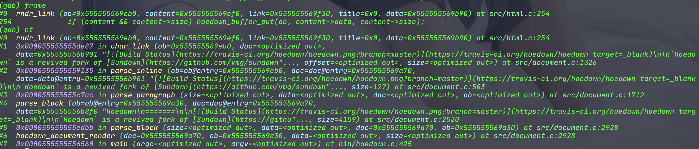

Title: 修改Markdown解析器,实现自定义行为
Date: 2022-05-27
Category: 兴趣爱好
Tags: 兴趣爱好
Slug: diy-markdown
Author: spk xu
Status: published
Summary: 最近在摆弄blog,特别是jekyll换到pelican后开始写了几篇blog.不知道怎么的,突然觉有markdown的外链处理不能使用_blank的方式打开特别不能忍.开始在enumitem中处理的方式使用模版改动给解决了,然后markdown中的模版无法解决,想想只能改markdown的解析器,那就开干吧.

对于pelican来说,markdown解析器相当于整个体系的心脏,给pelican换markdown解析器的想法,主要来自于无法忍受markdown在转换成html的过程中个,无法通过给markdown进行标注来得到某些自定义的行为.特别是对于link来说,如果我ref的是一个站内link,那么替换当前页面是没有问题的;但如果ref的一个站外link,作为blog的作者,我是不太愿意直接用这个link来替换掉我的页面的,所以最好的方式应该是使用_blank的打开方式.不过markdown对于如何自定义打开方式并不支持.要解决这个问题,方法不外乎就3种:

 - 忍了,因为markdown不支持,相当于法律就是这样,能忍就忍.99.99%的人会这样选择,并且还会理直气壮的和你说,markdown都不支持,能怎么办?
 - 看看是不是有变通的办法,找找pelican中的处理方式,看看能不能通过配置解决?如果配置不能解决,那能不能通过模版来解决?如果还不能,那就这样吧!
 - 不通过pelican解决,使用js等来解决也是可以的,能想到这个的已经属于有点想法的
 - 现在的markdown不支持就不能解决了吗?我就不信,老子就是头铁,怎么了?markdown说不行的,老子并要让它可以;选择这个的一般不是疯了,就是一群捣蛋分子,偏偏我就是不按常理出牌的主.

当然,并不是说改改配置,改改模版是不好的选择,只要问题能解决,就是有想法的.但是在pelican中,配置和模版都没办法解决问题.因为我去看了.哈哈

所以剩下的就是要么通过js来解决,要么通过更改markdown解析器来解决2条路了.先看看js怎么解决.pelican中使用了jquery框架的,所以最简单啊办法就是在document的ready函数中找到所有的`<a>`并且带有`href`属性的标签,并对于增加一个`target="_blank"`的属性,代码如:
	
	
PS:此代码来源于网上,未做测试.

把这个代码放在blog生成的base.html模版中,确实也能解决问题.但是不太符合我的需求,主要是这种方式对于整篇文章内的所有的link都做无差别的处理,这点就走到了另外一个"全部"的极端,所以还是放弃了.

说一个题外话,虽然我未曾使用js控制这种方式,但也不是说就没办法精确控制link的target属性赋予.markdown对于link的支持虽然很少,但也有2个属性,一个是href,另外一个还是title,那么我们是否可以通过title来区分哪些link是需要增加target属性的,哪些是不需要的?比如说:对于站内的link,我们统一对title使用形如`title-sitename`的格式,更暴力一些的话,规定所有具有title属性的link都会被赋予target属性.这样可以变更一下上面的js,改为通过拿到的title,分析title的具体规则区分哪些link是需要target属性的,哪些是不需要的.比如像这样:

		$("a").each(function(){ 
		var href = $(this).attr("href"); 
		if(href.indexOf(":_blank") > -1) 
			$(this).attr("target","_blank")
							.attr("href", href.replace(":_blank", "")); 
		});
		// <-. ^ .->你能看出来这个规则是什么吗?
PS:此代码来源于网上,未做测试.

其实"以title存在等同于target存在"的方式不错的,主要的优点有几个:

 - 这个最简单,最有效,在编写markdown的时候就能填写,对于编辑markdown没有大的区别;
 - 对技术要求最低,js大家都会,而且跟更改模板也更简单;
 - 对markdown原生影响最小的方式之一,因为在使用中,这个title本身就是锦上添花的作用,没有这个项,一样能很好的解析markdown文件;
 
要不是开始选择了改markdown解析器,我可能就用这个方法了.但是我们选择了更改markdown解析器的方式来去实现这个问题.为什么选择这种解决方案,主要是因为觉得有意思,并且想看看markdown解析器到底长什么样?

我们在网上搜了一下pelican使用的markdown解析器的信息,了解到pelican使用的markdown解析器是python-markdown,python自带的,在我们安装pelican的时候,如果按照了markdown的扩展模块那么就已经被按照了,去到lib目录下查看一下,确实有markdown这个文件夹存在.另外也从搜索的信息中得到一个信息,python-markdown模块有挺多的问题.虽然在使用的过程中,至少到目前为止还没碰到,可能我不算是重度用户.

另外找到一个开源的markdown解析器,[hoedown/hoedown: Standards compliant, fast, secure markdown processing library in C](https://github.com/hoedown/hoedown "hoedown#@#_blank_"),这个解析器适合我,用C写的,这个熟啊,改起来也方便.另外它也被广泛的使用不说,还有一个python的绑定器:[FSX/misaka: A Python binding for Hoedown](https://github.com/FSX/misaka "misaka#@#_blank_") 这对于pelican来说简直就是完美不?所以就开始开搞这个markdown解析器.

把hoedown的代码down下来,首先运行一下看看效果.编译也很简单,只要一个`make`命令即可编译完成,找到可执行文件,help一下看到用法,直接用`./hoedown url-test-file`命令进行测试,发现运行完好.那么就开始修改代码的历程.

对于hoedown的运行机制,我们都不熟悉,但是我们需要的是和链接有关系的地方.另外对于解析器,虽然没玩过,但是总体的流程应该是读入一个file,比如上面的url-test-file文件,然后进行转换,然后进行输出.一般是这样的流程.所以找到main函数,看到main函数中的代码如下"

	:::c
	/* Open input file, if needed */
	if (data.filename) {
		file = fopen(data.filename, "r");
		if (!file) {
			fprintf(stderr, "Unable to open input file \"%s\": %s\n", 
					data.filename, strerror(errno));
			return 5;
		}
	}
	
	/* Read everything */
	ib = hoedown_buffer_new(data.iunit);
	if (hoedown_buffer_putf(ib, file)) {
		fprintf(stderr, "I/O errors found while reading input.\n");
		return 5;
	}
	
	if (file != stdin) fclose(file);
	/* Create the renderer */
	switch (data.renderer) {
		case RENDERER_HTML:
			renderer = hoedown_html_renderer_new(data.html_flags, data.toc_level);
			renderer_free = hoedown_html_renderer_free;
			break;
		case RENDERER_HTML_TOC:
			renderer = hoedown_html_toc_renderer_new(data.toc_level);
			renderer_free = hoedown_html_renderer_free;
			break;
	};
	
	/* Perform Markdown rendering */
	ob = hoedown_buffer_new(data.ounit);
	document = hoedown_document_new(renderer, data.extensions, data.max_nesting);
	t1 = clock();
	hoedown_document_render(document, ob, ib->data, ib->size);
	t2 = clock();
	
	/* Cleanup */
	hoedown_buffer_free(ib);
	hoedown_document_free(document);
	renderer_free(renderer);
	
	/* Write the result to stdout */
	(void)fwrite(ob->data, 1, ob->size, stdout);
	hoedown_buffer_free(ob);

这个代码的流程和我们预想的大概一致,所以我们如果想要搞清楚里面的代码构造结构,完全可以从`hoedown_document_render`这个函数中剥洋葱似的一层一层处理,我们剥离到里面的时候,发现很多的代码是结构体+函数指针的模式.这就有点头疼,因为虽然函数指针运行时静态的可能性比较大,但是也保不齐会有运行时更改函数指针的"骚操作"出现.所以最好是我们能看看运行时是什么样?

我们需要处理的link相关的信息,所以我们先试试看能不能通过搜索的方式能找有关link的信息.搜一下link,发现有很多的代码和link有关,这样,我们先整理出来和link有关的函数,然后每个函数都大概看一看在做什么?我们发现一个`rndr_link`的函数做的是组装`<a>`的工作,那个这个函数大概率是已经parser完markdown的原始信息后,利用这些原始信息来组装输出的html文件了.

为了印证这个结果,我们在gdb中在这个函数上打一个断点,然后运行一下gdb看看情况.如下图:
	
整理一下,我们可以到如下的调用栈:

	hoedown_document_render
	parse_block
	parse_block
	parse_paragraph
	parse_inline
	char_link
	rndr_link

前面的都是parser函数,最后一个是render函数,那么,`char_link`函数最有可能就是那个parser_link的函数.(PS:一直没找到一个能通过运行命令直接能打印出来所有被调用执行函数的工具,有知道好用的工具的话,麻烦[联系我](mailto:xvhfeng@126.com).)我们找到`char_link`,查看代码发现确实是parser link的函数.现在link的parser函数和render函数全部找到,我们只要在这两个里面修改即可.

准备开始改代码,找到函数`char_link`,看一下代码,发现ref-url的解析一共有3中模式,如下:

	<https://www.runoob.com> #第一种,直接引用
	第二种引用-数字 [Google][{1]
	第二种引用-名字 [Runoob text][runoob]
	第三种 [Sundown](https://github.com/vmg/sundown)
	
	[1]: http://www.google.com/
	[runoob]: http://www.runoob.com/
	

要实现添加target属性,我们要先分析这三种格式,根据这三种格式的特点结合markdown的基础协议定下来一个Ex协议.这个Ex协议的唯一要求就是在尽可能不影响markdown标准协议的情况下,实现我们的功能.因为有第一种形式的存在,所以不太可能在`[]`中做手脚,所以显示的text被放弃,那么只能在`()`中做手脚.又因为这段时间一直使用Obsidian,该软件有一个功能是当ref一个站内的引用时,使用``的格式实现,其中`{filename}`即为站内ref的关键字.鉴于此种类型,首先想到的就是使用类似的语句,所以设计出来的格式为``凡是带有这种格式的ref-url即为需要增加target属性的,并且属性的值可以自定义.

那么按照上面的协议定义,我们对于上面的设定基本上即为如下:

	<{target="_blank"}https://www.runoob.com> #第一种,直接引用
	第二种引用-数字 [Google][{{target="targetname"1]
	第二种引用-名字 [Runoob text][{target="top"runoob]
	第三种 [Sundown]({target="_blank"https://github.com/vmg/sundown)
	
	[1]: http://www.google.com/
	[runoob]: http://www.runoob.com/

修改`char_link`的函数为如下:

	:::C
	/* char_link • '[': parsing a link, a footnote or an image */
	static size_t
	char_link(hoedown_buffer *ob, hoedown_document *doc, uint8_t *data, size_t offset, size_t size)
	{
		int is_img = (offset && data[-1] == '!' && !is_escaped(data - offset, offset - 1));
		int is_footnote = (doc->ext_flags & HOEDOWN_EXT_FOOTNOTES && data[1] == '^');
		size_t i = 1, txt_e, link_b = 0, link_e = 0, title_b = 0, title_e = 0;
		hoedown_buffer *content = NULL;
		hoedown_buffer *link = NULL;
		hoedown_buffer *title = NULL;
		hoedown_buffer *u_link = NULL;
		size_t org_work_size = doc->work_bufs[BUFFER_SPAN].size;
		int ret = 0, in_title = 0, qtype = 0;
	
	    /*add for link target attribute --> begin */
	    size_t target_b = 0,target_e = 0;
	    hoedown_buffer *target = NULL;
	    /* <--end  */
	
		/* checking whether the correct renderer exists */
		if ((is_footnote && !doc->md.footnote_ref) || (is_img && !doc->md.image)
			|| (!is_img && !is_footnote && !doc->md.link))
			goto cleanup;
	
		/* looking for the matching closing bracket */
		i += find_emph_char(data + i, size - i, ']');
		txt_e = i;
	
		if (i < size && data[i] == ']') i++;
		else goto cleanup;
	
		/* footnote link */
		if (is_footnote) {/*{{{*/
			hoedown_buffer id = { NULL, 0, 0, 0, NULL, NULL, NULL };
			struct footnote_ref *fr;
	
			if (txt_e < 3)
				goto cleanup;
	
			id.data = data + 2;
			id.size = txt_e - 2;
	
			fr = find_footnote_ref(&doc->footnotes_found, id.data, id.size);
	
			/* mark footnote used */
			if (fr && !fr->is_used) {
				if(!add_footnote_ref(&doc->footnotes_used, fr))
					goto cleanup;
				fr->is_used = 1;
				fr->num = doc->footnotes_used.count;
	
				/* render */
				if (doc->md.footnote_ref)
					ret = doc->md.footnote_ref(ob, fr->num, &doc->data);
			}
	
			goto cleanup;
		}/*}}}*/
	
		/* skip any amount of spacing */
		/* (this is much more laxist than original markdown syntax) */
		while (i < size && _isspace(data[i]))
			i++;
	
		/* inline style link */
		if (i < size && data[i] == '(') {/*{{{*/
			size_t nb_p;
	
			/* skipping initial spacing */
			i++;
	
			while (i < size && _isspace(data[i]))
				i++;
	
	        /*add for link target attribute --> begin */
	        if('{' == data[i] && (i < size)) {
	
	            i++;
	            while (i < size && _isspace(data[i])) {
	                i++;
	            }
	
	            target_b = i;
	            while(i < size) {
	                if('}' == data[i]){
	                    break;
	                }
	                i++;
	            }
	
	            if (i >= size) goto cleanup;
	
	            target_e = i - 1;
	            while (target_e > target_b && _isspace(data[target_e]))
	                target_e--;
	
	            if (data[target_e] != '\'' &&  data[target_e] != '"') {
	                target_b = target_e = 0;
	                target_e = i;
	            }
	
	            if(target_e > target_b) {
	                target = newbuf(doc, BUFFER_SPAN);
	                hoedown_buffer_put(target, data + target_b, target_e - target_b + 1);
	            }
	
	            i++;
	            while (i < size && _isspace(data[i]))
	                i++;
	        }
	        /*<--end */
	
	        link_b = i;
	
	        /* looking for link end: ' " ) */
	        /* Count the number of open parenthesis */
	        nb_p = 0;
	
	        while (i < size) {
	            if (data[i] == '\\') i += 2;
	            else if (data[i] == '(' && i != 0) {
	                nb_p++; i++;
	            }
	            else if (data[i] == ')') {
	                if (nb_p == 0) break;
	                else nb_p--; i++;
	            } else if (i >= 1 && _isspace(data[i-1]) && (data[i] == '\'' || data[i] == '"')) break;
	            else i++;
	        }
	
	        if (i >= size) goto cleanup;
	        link_e = i;
	
	        /* looking for title end if present */
	        if (data[i] == '\'' || data[i] == '"') {
	            qtype = data[i];
	            in_title = 1;
	            i++;
	            title_b = i;
	
	            while (i < size) {
	                if (data[i] == '\\') i += 2;
	                else if (data[i] == qtype) {in_title = 0; i++;}
	                else if ((data[i] == ')') && !in_title) break;
	                else i++;
	            }
	
	            if (i >= size) goto cleanup;
	
	            /* skipping spacing after title */
	            title_e = i - 1;
	            while (title_e > title_b && _isspace(data[title_e]))
	                title_e--;
	
	            /* checking for closing quote presence */
	            if (data[title_e] != '\'' &&  data[title_e] != '"') {
	                title_b = title_e = 0;
	                link_e = i;
	            }
	        }
	
	        /* remove spacing at the end of the link */
	        while (link_e > link_b && _isspace(data[link_e - 1]))
	            link_e--;
	
	        /* remove optional angle brackets around the link */
	        if (data[link_b] == '<' && data[link_e - 1] == '>') {
	            link_b++;
	            link_e--;
	        }
	
	        /* building escaped link and title */
	
	        if (link_e > link_b) {
	            link = newbuf(doc, BUFFER_SPAN);
	            hoedown_buffer_put(link, data + link_b, link_e - link_b);
	        }
	
	        if (title_e > title_b) {
	            title = newbuf(doc, BUFFER_SPAN);
	            hoedown_buffer_put(title, data + title_b, title_e - title_b);
	        }
	
	        i++;
	    }/*}}}*/
	
		/* reference style link */
		else if (i < size && data[i] == '[') {/*{{{*/
	
	        /* skipping initial spacing */
			i++;
	
			while (i < size && _isspace(data[i]))
				i++;
	
	        /*add for link target attribute --> begin */
	        if('{' == data[i] && (i < size)) {
	
	            i++;
	            while (i < size && _isspace(data[i])) {
	                i++;
	            }
	
	            target_b = i;
	            while(i < size) {
	                if('}' == data[i]){
	                    i++;
	                    break;
	                }
	                i++;
	            }
	
	            if (i >= size) goto cleanup;
	
	            target_e = i - 2;
	            while (target_e > target_b && _isspace(data[target_e]))
	                target_e--;
	
	            if (data[target_e] != '\'' &&  data[target_e] != '"') {
	                target_b = target_e = 0;
	                target_e = i;
	            }
	
	            if(target_e > target_b) {
	                target = newbuf(doc, BUFFER_SPAN);
	                hoedown_buffer_put(target, data + target_b, target_e - target_b + 1);
	            }
	
	            while (i < size && _isspace(data[i]))
	                i++;
	        }
	        /*<--end */
	
	        hoedown_buffer *id = newbuf(doc, BUFFER_SPAN);
	        struct link_ref *lr;
	
	        /* looking for the id */
	        link_b = i;
	        while (i < size && data[i] != ']') i++;
	        if (i >= size) goto cleanup;
	        link_e = i;
	
	        /* finding the link_ref */
	        if (link_b == link_e)
	            replace_spacing(id, data + 1, txt_e - 1);
	        else
	            hoedown_buffer_put(id, data + link_b, link_e - link_b);
	
	        lr = find_link_ref(doc->refs, id->data, id->size);
	        if (!lr)
	            goto cleanup;
	
	        /* keeping link and title from link_ref */
	        link = lr->link;
	        title = lr->title;
	        i++;
	    }/*}}}*/
	
		/* shortcut reference style link */
		else {/*{{{*/
			hoedown_buffer *id = newbuf(doc, BUFFER_SPAN);
			struct link_ref *lr;
	
			/* crafting the id */
			replace_spacing(id, data + 1, txt_e - 1);
	
			/* finding the link_ref */
			lr = find_link_ref(doc->refs, id->data, id->size);
			if (!lr)
				goto cleanup;
	
			/* keeping link and title from link_ref */
			link = lr->link;
			title = lr->title;
	
			/* rewinding the spacing */
			i = txt_e + 1;
		}/*}}}*/
	
		/* building content: img alt is kept, only link content is parsed */
		if (txt_e > 1) {
			content = newbuf(doc, BUFFER_SPAN);
			if (is_img) {
				hoedown_buffer_put(content, data + 1, txt_e - 1);
			} else {
				/* disable autolinking when parsing inline the
				 * content of a link */
				doc->in_link_body = 1;
				parse_inline(content, doc, data + 1, txt_e - 1);
				doc->in_link_body = 0;
			}
		}
	
		if (link) {
			u_link = newbuf(doc, BUFFER_SPAN);
			unscape_text(u_link, link);
		}
	
		/* calling the relevant rendering function */
		if (is_img) {
			ret = doc->md.image(ob, u_link, title, content, &doc->data);
		} else {
			ret = doc->md.link(ob, content, u_link, title,target, &doc->data);
		}
	
		/* cleanup */
		cleanup:
		doc->work_bufs[BUFFER_SPAN].size = (int)org_work_size;
		return ret ? i : 0;
	}

 上面的代码中,凡是在

	:::C
	 /*add for link target attribute --> begin */
	 
	 /* <--end */ 
在这个注释中包围的代码都是增加的代码,另外还修改了一段代码:

	:::C
	ret = doc->md.link(ob, content, u_link, title, &doc->data);
	改为
	ret = doc->md.link(ob, content, u_link, title,target, &doc->data);
这样的话,`doc->md.link`这个函数指针所对应的函数指针定义也需要更改.,这就不在累述.

parser函数完成后,render函数`rndr_link`也需要更改,我们将其改为如下:

	:::C
	static int
	rndr_link(hoedown_buffer *ob, const hoedown_buffer *content, const hoedown_buffer *link, const hoedown_buffer *title,
	        const hoedown_buffer *target,  const hoedown_renderer_data *data)
	{
		hoedown_html_renderer_state *state = data->opaque;
	
		HOEDOWN_BUFPUTSL(ob, "<a href=\"");
	
		if (link && link->size)
			escape_href(ob, link->data, link->size);
			
		/*add for link target attribute --> begin */
		if (target && target->size) {
			HOEDOWN_BUFPUTSL(ob, "\" ");
	        hoedown_buffer_put(ob,target->data,target->size-1);
	    }
	    /* <--end */ 
	
		if (title && title->size) {
			HOEDOWN_BUFPUTSL(ob, "\" title=\"");
			escape_html(ob, title->data, title->size);
		}
	
		if (state->link_attributes) {
			hoedown_buffer_putc(ob, '\"');
			state->link_attributes(ob, link, data);
			hoedown_buffer_putc(ob, '>');
		} else {
			HOEDOWN_BUFPUTSL(ob, "\">");
		}
	
		if (content && content->size) hoedown_buffer_put(ob, content->data, content->size);
		HOEDOWN_BUFPUTSL(ob, "</a>");
		return 1;
	}
注意函数的签名增加了target的参数.

到此markdown解析器的代码修改完毕.下一步就是如何和pelican结合起来.因为Misaka的存在,所以我们直接把修改好的整个的hoedown工程中修改的文件`document.c` `documenth` `html.c`3个文件cp到Misaka的相应目录进行替换,然后**在py对应的venvs环境下**,参照Misaka的README文件进行install即可.

markdown解析器的问题解决后,再来对pelican进行Misaka的集成.

在pelican中,查看代码,找到`readers.py`文件,其中有`class MarkdownReader`即为markdown解析器解析文件到html的地方.别问我怎么知道的?我说凭灵感和经验你相信吗?哈哈!其实还真的是经验让我去找这个文件的.在这个文件里,有个函数`read`,如下:

	:::python
		def read(self, source_path):
	        """Parse content and metadata of markdown files"""
	
	        self._source_path = source_path
	        self._md = Markdown(**self.settings['MARKDOWN'])
	        with pelican_open(source_path) as text:
	            content = self._md.convert(text)
	
	        if hasattr(self._md, 'Meta'):
	            metadata = self._parse_metadata(self._md.Meta)
	        else:
	            metadata = {}
	        return content, metadata
此函数即为pelican调用python-markdown来处理文件的地方.所以我们依葫芦画瓢,引入Misaka,然后用Misaka来解析即可.

第一步,import misaka,所以在文件的import区域,增加以下代码,变成这样:

	:::python
	try:
	    from markdown import Markdown
	    import misaka 
	except ImportError:
	    Markdown = False  # NOQA

第二步讲原来的`read`函数改为Misaka驱动.

	:::python
		def read(self, source_path):
	        self._source_path = source_path
	        self._md = Markdown(**self.settings['MARKDOWN'])
	        
	        with pelican_open(source_path) as text:
				content = misaka.html(text)
	
	        if hasattr(self._md, 'Meta'):
	            metadata = self._parse_metadata(self._md.Meta)
	        else:
	            metadata = {}
	
	        return content, metadata

理论上这样已经完成了markdown解析器的替换,但是运行的时候,不管弄,都会出错,blog不能生成.这个问题找了很久,终于在比较了`python-markdown`和`Misaka`生成的文件后,发现了问题.对于python-markdown生成的content,原文件中的head部分都没有了,只有正文部分.而misaka生成的content不仅带有正文部分,还有head部分.所以不管你怎么弄文件内容的格式错了,再怎么对都对不回来.

那么就要解决这个问题,首先想到的是把head部分人为去掉就行了,有因为我们的blog的head部分基本是固定的,一般就是7行,所以只要去掉这最前面的7行即可.讲misaka的read函数改为如下:

	:::python
		def read(self, source_path):
	        self._source_path = source_path
	        self._md = Markdown(**self.settings['MARKDOWN'])
	        
	        with pelican_open(source_path) as text:
				txtlines = text.split("\n")
				ctxlines = txtlines[8:]
				strlines = '\n'.join(ctxlines)
				content = misaka.html(strlines)
	
	        if hasattr(self._md, 'Meta'):
	            metadata = self._parse_metadata(self._md.Meta)
	        else:
	            metadata = {}
	
	        return content, metadata

这样使用misaka作为pelican markdown解析器的工作就完成了.试试看运行一下pelican的生成命令,blog即可正常生成的.

但是另外好奇心,让我去想看看如果我不更换markdown解析器,而是直接使用pelican的python-markdown解析器,在这个解析器的基础上怎么做呢?

去venvs环境下的lib中找到markdown,然后看看的代码,因为对这个项目不熟悉,所以同样的手法,在这个项目里面直接搜link,发现了`class LinkInlineProcessor(InlineProcessor):`这个函数的存在,这个看上去就是link的处理器啊.直接定位到这个函数,这个类中就3个方法,一个match方法,一个getText,一个getLink,这还要解释吗?直接看getLink函数啊.观察了一下getLink的函数,发现它也是具有title和link两个属性,这里我想试试看使用title来实现target这个属性的添加.所以就设计了一个形如`title#@#_blank`这样的形式来完成.废话就不多说了,直接看看更改后的代码:

	:::python
		def getLink(self, data, index):
	        """Parse data between `()` of `[Text]()` allowing recursive `()`. """
	
	        href = ''
	        title = None
	        handled = False
	        target = None
	
	        m = self.RE_LINK.match(data, pos=index)
	        if m and m.group(1):
	            # Matches [Text](<link> "title")
	            href = m.group(1)[1:-1].strip()
	            if m.group(2):
	                title = m.group(2)[1:-1]
	            index = m.end(0)
	            handled = True
	        elif m:
	            # Track bracket nesting and index in string
	            bracket_count = 1
	            backtrack_count = 1
	            start_index = m.end()
	            index = start_index
	            last_bracket = -1
	
	            # Primary (first found) quote tracking.
	            quote = None
	            start_quote = -1
	            exit_quote = -1
	            ignore_matches = False
	
	            # Secondary (second found) quote tracking.
	            alt_quote = None
	            start_alt_quote = -1
	            exit_alt_quote = -1
	
	            # Track last character
	            last = ''
	
	            for pos in range(index, len(data)):
	                c = data[pos]
	                if c == '(':
	                    # Count nested (
	                    # Don't increment the bracket count if we are sure we're in a title.
	                    if not ignore_matches:
	                        bracket_count += 1
	                    elif backtrack_count > 0:
	                        backtrack_count -= 1
	                elif c == ')':
	                    # Match nested ) to (
	                    # Don't decrement if we are sure we are in a title that is unclosed.
	                    if ((exit_quote != -1 and quote == last) or (exit_alt_quote != -1 and alt_quote == last)):
	                        bracket_count = 0
	                    elif not ignore_matches:
	                        bracket_count -= 1
	                    elif backtrack_count > 0:
	                        backtrack_count -= 1
	                        # We've found our backup end location if the title doesn't resolve.
	                        if backtrack_count == 0:
	                            last_bracket = index + 1
	
	                elif c in ("'", '"'):
	                    # Quote has started
	                    if not quote:
	                        # We'll assume we are now in a title.
	                        # Brackets are quoted, so no need to match them (except for the final one).
	                        ignore_matches = True
	                        backtrack_count = bracket_count
	                        bracket_count = 1
	                        start_quote = index + 1
	                        quote = c
	                    # Secondary quote (in case the first doesn't resolve): [text](link'"title")
	                    elif c != quote and not alt_quote:
	                        start_alt_quote = index + 1
	                        alt_quote = c
	                    # Update primary quote match
	                    elif c == quote:
	                        exit_quote = index + 1
	                    # Update secondary quote match
	                    elif alt_quote and c == alt_quote:
	                        exit_alt_quote = index + 1
	
	                index += 1
	
	                # Link is closed, so let's break out of the loop
	                if bracket_count == 0:
	                    # Get the title if we closed a title string right before link closed
	                    if exit_quote >= 0 and quote == last:
	                        href = data[start_index:start_quote - 1]
	                        title = ''.join(data[start_quote:exit_quote - 1])
	                    elif exit_alt_quote >= 0 and alt_quote == last:
	                        href = data[start_index:start_alt_quote - 1]
	                        title = ''.join(data[start_alt_quote:exit_alt_quote - 1])
	                    else:
	                        href = data[start_index:index - 1]
	                    break
	
	                if c != ' ':
	                    last = c
	
	            # We have a scenario: [test](link"notitle)
	            # When we enter a string, we stop tracking bracket resolution in the main counter,
	            # but we do keep a backup counter up until we discover where we might resolve all brackets
	            # if the title string fails to resolve.
	            if bracket_count != 0 and backtrack_count == 0:
	                href = data[start_index:last_bracket - 1]
	                index = last_bracket
	                bracket_count = 0
	
	            handled = bracket_count == 0
	
	        ctitle = None
	        real_title = None
	        target = None
			
			#use title,so this code is modify#
			
	        if title is not None:
	            ctitle = self.RE_TITLE_CLEAN.sub(' ', dequote(self.unescape(title.strip())))
	            idx = ctitle.find("#@#")
	            if idx != -1 :
	                print(ctitle," found #@#  ", idx)
	                if ctitle.startswith("#@#") :
	                    real_title = None
	                    target = "".join(ctitle[3:])
	                elif ctitle.endswith("#@#") :
	                    real_title = "".join(ctitle[0:-3])
	                    target = None
	                else :
	                    real_title = "".join(ctitle[0:idx])
	                    target = "".join(ctitle[idx + 3 :])
	            else :
	                real_title = ctitle
	                
	        href = self.unescape(href).strip()
	        return href, real_title, index, handled,target

整个功能的更改基本都是在`if title is not None:`这个代码块中实现.除了更改了这个代码块,还给返回值增加了target的值,所以这个函数相应调用的地方也要补上target函数的承接,这部分不在累述.

使用这个办法也可以增加target属性.

一共讲了3中办法来使pelican的markdown文件在展现为html文件的时候支持link使用自定义的打开方式.中间js的最简单,最容易,最方便的一种办法,另外给pelican的python-markdown解析器增加功能难度次之,稍微懂一点python的可以直接徒手替换;使用misaka,不到万不得已别尝试,这种方式除了需要了解pelican,python之外,还需要对C有熟练的运用能力,所以可以作为兴趣来去做做看,是是是看.

但是不管怎么说,给pelican换markdown解析器,相当于直接进行了一次心脏手术.对于我这个曾经只知道使用markdown解析器的人来说,难度与诱惑一样大.甚至内心的兴奋远远大于难度带来的恐惧,明知可能的结果是不了了之,特别是misaka解析器的运用,但还是功夫不负有心人,最后还是实现了我们需要的功能.其实在我的blog中,js的集成我也用了,而且我是另外一种形式.因为相比需要知道自定义的协议,不管是`{target}`的模式,还是`title#@#`的模式,你总归都需要额外的精确记忆一些东西.那么如果有一种办法,只要有title的直接能给与链接的`_blank`模式,是不是会会很香呢?