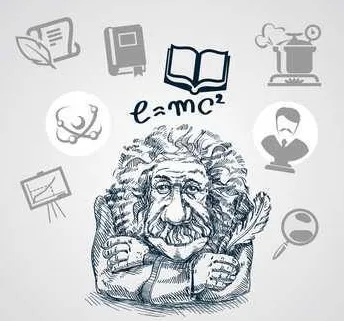
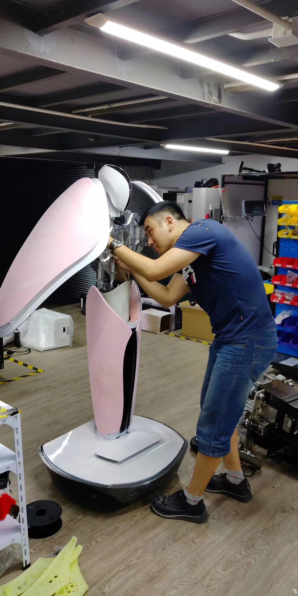

Title: 被高智商"支配"的恐惧
Date: 2022-07-10
Category: 就是好玩
Tags: 就是好玩
Slug: high-iq
Author: spk xu
Status: published
Summary: 每次聊技术,或者是IT方面中难免有些审美疲劳,这次咱就不唠技术了,咱唠唠做这些技术的人,特别是那些让你万分惊叹,而且就在你身边的人......,题目呢,有点大了,其实相互之间也不存在支配不支配的关系,但是这个世界,总体是在"高智商"的那群人的支配下运转,这不是什么坏事,科学的进步,技术的发展都是离不开高智商的,唯一可惜的是,你和我都不是那个种族......

很多人都说, 程序员是一个高智商的群体.作为这一行的从业者,从目前我说接触的公司里面的人来看,这句话很多时候是站不住脚的.这一群人里面,大部分的人都是普通人,放在人群里面也就是明明众人而已,高智商不一定能算上,但是倒是既有可能会被扣上"木讷"的标签.但是精英确实存在,但是相对来说还是比较少的,但公司越好,你碰到的概率就越高.工作16年,除了第一家小公司(本身人数就没超过50人),剩下的公司里面都有那种高智商的"神人".

先说说我自己吧..首先我确定&肯定我自己就是一个智商的渣渣.虽然我上学的时候,我各个阶段的老师都和我爹妈说,我这孩子脑子可以,就是不用功.但是学习的最终成绩说明了我只是一个"智商的战五渣".小学到高中12年,没什么可以炫耀的不提吧,倒是有很多的"伤仲永",虽然现在生活和工作还算过得去,但是这个12年,除了初中阶段某个短暂的时间段外,更长的时间内是一个失败的典型.大学后,开始依然延续"战五渣",虽然只要是正经参加的考试,保证不挂科,但如果"及格"是一个大学学习的终点的话,那也太失败了.后面的改观也许是兴趣的原因,对于电脑和编程从高中开始就表现出了要好于身边同学的水平,也就这学的还不错.当年基本都是自学,包括java和c等等,编程与技术的书,基本能保证一遍80%-90%的记忆强度.工作后亦是如此,硬是这样搞了几年,随着工作经验的增加和跳跃公司级别的上升,眼界和实践同步增长,跟上你身边人的脚步,总会在比较短的时间内完成适应和追赶,也能获得比较高的认可和尊重.所以就造成了一种假象:我好像觉得我自己"**行**"了,学习能力,技术能力,时间进度都"**仁**"了.这种良好的感觉直到遇见了那一群真正占领智商高地的人.那群和你一起工作一起玩,但是:你想不到的他们做得到,你努力拼搏他们小菜一碟,你跳着才能够到的他们可能只要坐着就可以了.就像你上学的时候,明明大家都在操场踢球,但是考试你及格,他满分.呃...那些你看着一直和你在一起,但是潜移默化中就能把你不知道甩到那个河边的同事.对于这群人,到目前为止他们的共同特点除了高智商,另外一个基本特征就是:保送/少年班.

** 被高智商的支配,你才明白:你取得的成绩和成果看上去是因为你的智商,其实是你玩命的努力,而对他们是天赋,是玩儿,是轻而易举.**

一个一个的来说明我遇到的那些神人.

第一位牛人: 是我在飞客在线的CTO,传说中,他毕业于中科大少年班.09年的时候,他已经35+了吧.就是他单挑了当时飞客在线的技术栈中间件.真正震撼的并不是"单挑",而是在那个年代,他所具备的已经超过当时时代发展水平的认知和技术敏感度,并且能在别人无法帮助或者是认知不在同一水平的情况下,单枪匹马把他的认识和想法实现了,真正的用于了商用.每天能给公司带来2kw的流水收入,能每天抗住"双十一秒杀"的压力.虽然现在来看,当时使用的技术有一些有一点老,有一些已经是目前大家的常识和共知了.但现在相距09年已经过去了10+年了,何况这个技术栈开始动第一行代码的时间是06年呢?作为参照:那个年代taobao还在php刚刚诞生,ali还在靠IOE扛压力,jd可能还在卖光盘了吧?虽然这些事情后来我也干了一遍,但我的albianj也是建立在他的理论基础上,特别是思想和决策部分其实没有特别大的改变,还是那些问题,还是那些解决方案.包括目前整个市面上的技术发展面,解决方案总体上也没大的改变,当时的思想和认知还能用,也一直用着,并不过时.所以一个是造物主,一个是模仿者,虽然干的事情一样,虽然模仿者增加了改进的部分,但是手掌心还是那个手掌心...

第二位: 还是我在飞客的同事.在飞客在线的时候我还不知道他是属于这样的神人.我们同事时间1年多,开始的时候给我的感觉是**神龙见首不见尾**.当年我也自负过,对于技术人士,自从我们的CTO离开后,在飞客在线未曾佩服过任何人,当然直到遇到了他.他是另外一个团队合并的时候过来的,根本不属于一个团队,但是有幸排座位的时候又排到了一起,我们的性格也相近,技术我也还算能够上和人家聊一聊(也只配聊一聊),大家就这样一起吃吃喝喝,骂骂闹闹混成了哥们.虽然现在平时已经联系不多了,但是大家在做什么都是清楚的,如果有帮忙那也只是一个电话的事情,根本不会有推脱的那种.

再来说说这个鸟人,他第一次让我震撼的事情是,在那个年代,他自己写了一个运维系统,来管理他的搜索的软件生命周期,从开发到上线.他在飞客在线当时是做搜索的,搜索对于他来说就好像是玩一样,(后面我才知道,他曾经在google欧洲中心待了一段时间),搜索主体搞完后他开始对于我们当时的运维体系有很大的不满,因为不能做到自动化,上线发布都需要自己搞,也没有build-when-building,也没有update-online,甚至都没有报表提供运行时状态,他督促了运维部门一段时间发现推不动.人家不再废话,直接肉身下场自己来构建符合他"口味的"运维系统.这个运维系统作为搜索系统的附属品知道的人不多,因为他也不想和他们一帮子人废话去推广,有这个时间还不如去改改车来的快乐.随着搜索的上线和稳定,公司需要推荐,也是他在没有增加人员的情况下,直接解决问题.

后来,我先于他离开了飞客在线.以他的性格能在飞客在线算得上朋友的太少了.所以他的离开也只是一个时间问题.他离开的时候联系我问了一下工作的事情,我当时劝他不要去OTA公司,因为OTA的环境我都受不了,以我对他的了解,他肯定更受不了!不过他还是给我发来了他的简历,我打开一看,这不是惊诧,简直就是对于智商欠费人士的虐杀:本硕世界TOP大学毕业,博士因瑞士签证被移民局赶回来现在还悬空着答辩安排,所以现在也不知道应该什么业? E文/F文交流沟通无障碍,本硕课程E文/F文随机授课,论文F文写的.曾经在google欧洲中心玩了一段时间.高中当年江苏省信息奥赛第一名保送清华,然而人家选择**不去**.后来吃饭的时候聊起来这件事,给我的回答的是:清华又不是什么好学校,我为什么要去?作为学渣的我当时......

**The Fucking IQ **

这个鸟人真正让我震撼并不是智商,而是他的洒脱.在这个功利的社会,可以放弃任何自己不想干的事情,专心干自己喜欢干的事情而且不仅能靠他吃饭,还能把它干的很好.

多年后,因为我们想做搜索,我去找了他一回.在饭桌上,我和他说了一下我们当时的情况.他和我说对搜索不感兴趣,当前的技术发展不管是狭义垂直型还是广义型的搜索,本质上就这样了,对于技术来说已经不是搜索本身的技术发展,而是机器的数量发展.我认同他的观点,想拉他入伙的想法到此打住,大家一起愉快的吃了一顿.可惜大佬TM没给我报销这顿饭钱......

后来他在HX公司算是安定了下来.在HX去做了智能的工作,后来觉得智能的路子有点窄,想落地的话必须得有一个实体的东西.所以他就去"忽悠"老板给他弄一个实验室.对,就是实验室,类似apple的工业实验室那种,他主要做机器人.所以当你现在进HX买家具的时候,进门会看见一个机器人欢迎你,这就是他做的.这些倒都是其次,做主要的是,在做这个之前,他未曾接触过工业设计之类的相关知识.所以他就自学工业设计,在pyq看见他发那种设计的图稿,当时还很诧异,后来才知道,原来去干这个事情了.他终于找到了一个他自己喜欢并且乐意去长时间做的工作了.对于指向用IQ,压根看不起EQ的他来说,在当前的社会现实下,太难了.

前几天,看见hhkb有个日列版的我很喜欢,我知道他有三维打印,已经和他说让他去给我搞一个,不知道啥时候能有成品?

哎,不知道该说些啥了,高智商......

支配......

虐杀......

有时候承认自己做不到是一件很难的事情......
