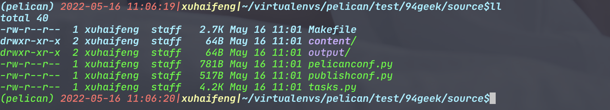

Title: 从jellky迁移至pelican
Date: 2022-05-15
Category: 兴趣爱好
Tags: 兴趣爱好
Slug: jellky-to-pelican
Author: spk xu
Status: published
Summary: 因为新机器上一直无法解决ruby和jellky兼容的问题,导致原来基于jellky的blog一直无法运行.对于ruby,确实也不熟悉,所以解决问题的可能性就更小了.星期天在家无意中看到github上很久之前就fork的基于python的pelican,抱着试试看的态度把blog从jekyll迁移到了pelican.这里记录了整个的迁移过程.没想到的是,整个过程波澜不惊,不管是公用的需求还是个人的喜好,通过一些配置和规则,pelican竟然都能很快找到答案,并且能很好的支持.

将blog从jekyll迁移至pelican,从开始行动,到最后本地成功,一直都是一个无心拆柳柳成荫的行为.最开始的原因是因为:新的Mac一直无法运行jellky,也不知道什么原因,系统上的jekyll和ruby一直存在兼容问题.但是同样版本,同样方法安装的jellky好人ruby在老的Mac确实稳如狗.对于ruby,确实不熟悉,所以解决问题也一筹莫展.在很长一段时间内,blog一直被闲置(终于找到一个长期不更新blog的理由,狗头奇怪!).

这个星期天在家逛github,无意中看见很久之前fork的pelican,当初为什么fork这个项目已经无从考证了,仔细看了一下,是基于python的blog的生成工具.python,这个我还是熟悉的,至少比ruby熟悉很多吧.所以就抱着试试看的态度把blog迁移了.

## virtualenvs

首先把pelican程序给更新了,然后clone下来进行了安装.整个过程中,使用了virtualenvs对pelican进行了环境隔离.对于venv还是非常推荐的,它可以很好的隔离你安装的程序和系统的环境,使用venv,可以让你实现搞不定pelican的情况下,删库跑路,不留下一丁点痕迹.所以对于python程序来说,venv基本就是居家旅行,杀人越货的必备良药.

    :::bash
    安装  Pelican
    sudo port selfupdate  #更新macprot
    sudo port install py39-virtualenv   #安装py39对应的venv,因为机器上的py是py39版本
    sudo port select --set virtualenv virtualenv39 #设置默认的venv版本
    virtualenv ~/virtualenvs/pelican  #创建一个pelican专属环境,你可以把它理解为py虚拟机
    cd ~/virtualenvs/pelican  #进入目录
    source bin/activate #这里是进入虚拟机,其实看了一下脚本,你可以简单的理解为加载PATH即可
    python -m pip install pelican  #安装pelican
    python -m pip install "pelican[markdown]" #安装markdown插件

到这里为止,我们在我们的机器上新建了一个py39的venv环境,你可以把这个是一个具有所有py39版本的虚拟机,然后在这个虚拟机里面安装了pelican和pelican的框架. 有兴趣的话可以查看一下你新建虚拟机的目录,在我们的机器上是~/virtualenvs/pelican这个目录.在这个目录下,存在两个子目录:bin和lib.

- bin目录下为所有py39的可执行命令,另外如果你在这个venv中执行pip命令,那么安装的可执行文件也会出现在这个bin目录下;

- lib目录即为py39的所有库文件,同bin,如果同环境下pip安装,那么库部分会放在lib目录下;
  
  另外上面的命令中:
  
  :::bash
  source bin/activate

特别重要,你可以把这句命令看成是"启动"虚拟机,其实在系统中,是设置当前环境的PATH,让你可以在当前命令行中直接调用当前环境下命令.

PS:如果你不想要这个venv了,直接把这个目录删除就可以了.有没有"删库跑路"的快感?!

## pelican基础

搞好py虚拟机,安装好pelican的基本环境后,下面就开始建立blog.

先使用pelican的命令快速的搭建一个空的架子,在这个架子上搭建我们的blog会更加的快速一些.使用如下命令:

    :::bash
    # 注意当前命令必须链接在上面的venvs环境下执行
    mkdir -p 94geek/source #因为blog的名字就是94geek,所以就创建一个同名字的
    cd 94geek/source  # 完整路径~/virtualenvs/pelican/94geek/source
    pelican-quickstart #新建一个blog的框架
    
    pelican --autoreload --listen  #启动blog  默认本机,端口8000

以上的命令让我们在原来的vens的目录下创建了一个以我们的blog为名字的目录,之所以再创建一个source目录是因为想到后续还会有pelican的一些组件什么可能需要拉取安装之类的,这样能分门别类的管理清楚.再使用pelican的快速启动命令生成了一个框架,生成框架的过程很简单,照着提示问答一些诸如:blog的名字,作者的名字,url,时区...这些问题就可以了.这里最好是如实填写,但是如果你瞎写也没关系,后续可以在配置文件中更改.生成框架的命令执行完后,后续会在当前文件夹下生成一个以你blog名字为路径的/blog-name/source/的目录.,在我们的机器上如下图:

所以,开始的我们创建的/blog-name/source/的目录其实是多此一举了,不过也无所谓反正是同名.

在source目录中的几个文件和文件夹,它们的作用分别如下:

- Makefile: 一个可以通过make命令来运行pelican和生成blog文章等操作的快速命令集合,它的原理是pelican通过定义makefile的某些目标执行的命令,以此让使用者可以通过统一的make target的方式来控制pelican,熟悉makefile规则的同学可以打开看一下,一下就能看明白;
- content: 这个文件夹即为我们的整个blog的root目录,只不过是提供我们编辑的场所.你可以在里面新建一些文件夹,比如我的新建如下:
  - files: 放置静态文件,可以在files文件夹下面再新建images,js,css等等你需要的子目录;
  - posts: 这是我们blog重点所在,我们的blog文章的原始rst或者md文件全部在这个目录下,当然为了方便,你也可以在这个目录下新建子目录来控制原始文件的存放;
  - pages:这个文件夹是存放一些纯页面的地方,它不是一些html文件,也是一些markdown文件,但是这里的文件只是会简单的生成,不会产生某些站点的副作用(比如:sitemap之类的).一般这个文件我们会存放一些对于网站,或者是自己介绍性的文章;
- pelicanconf.py: 这个文件是整个pelican环境的配置信息,在我们创建框架的时候输入的一些信息会以配置信息的方式存放在这个文件中,在不断完善pelican的过程中,我们讲一直和这个文件打交道.
- publishconf.py: 这个文件是pelican发布信息的配置文件.
- task.py: 发布时候的一个文件,目前暂未使用

至此,我们可以在source文件夹下执行命令:

    :::bash
    pelican --autoreload --listen

 来启动pelican,只不过到目前为止,我们没有任何的东西,在浏览器中使用http://127.0.0.1:8000查看的时候是一个空的blog,相当于目前我们的blog还是毛胚状态,虽然可以使用,但是一点美感都没有,所以我们还是要适当的装修一下.

## 主题

下一步,我们将对我们的blog装修一下.一般具有blog经验的开发者说到装饰blog,那么第一个想到的绝对也是去找一个皮肤,或者高大上一些叫做主题.pelican也给我们准备了很多的主题,找到主题的仓库:[Pelican的主题](http://www.pelicanthemes.com/ "Pelican的主题"),选取一个你自己喜欢的主题,然后先fork到自己的github,再clone到本地.为什么要先fork然后再clone而不是直接clone,主要有2个原因:

1. 为了避免后续仓库被删除或者仓库不存在之类的问题,还是先fork了安心;
2. 对于既有主题,肯定有一些是不对你胃口的,所以你肯定是要去修改一些东西的;那么你还不如直接在你自己的仓库上去修改;

我个人因为不需要花里胡哨,也不喜欢那种很多栏目的blog,所以就选了一个相对比较简单但是又不是那么"毛胚"的主题:pelican-clean-blog.把这个主题的代码拉到本地,在source同级的目录中,建立一个名为themes的文件夹,把pelican-clean-blog的代码拉取到themes目录下,这样做的好处是:当你对其它主题见异思迁的时候,你可以方便的在themes目录下拉取多个主题,然后每个都可以试试,反正试试也不要钱.

    :::bash
    pelican-themes -lv  #查看当前已经安装的主题
    pelican-themes --install ./pelican-clean-blog/ --verbose #安装主题
    pelican-themes -lv #查看一下主题是否已经被安装

使用上面的命令安装本地的主题到pelican的环境下,使用-v参数可以看到主题安装存放的地址.在我的机器上,主题被安装到了venvs下lib目录下:

  virtualenvs/pelican/lib/python3.9/site-packages/pelican/themes/pelican-clean-blog
记住这个路径,后面有用.

要启用这个主题,我们还得在pelicancong.py文件上增加一行:

    :::python
    THEME = "pelican-clean-blog" # 说明使用主题,主题必须安装到当前环境下

然后我们再启动pelican,就能看到带有主题的blog,但是因为我们还是么有放内容,所以当前的blog还是空的.

## 配置与自定义
### 自定义
在选择的pelican-clean-blog主题上,带有Social widget和menuitems的功能.前者一般被配置为SNS等账号,比如wechat,facebook等等;后者为blog上一些除正文内容外的内链和外链,比如内链有"关于",等等,外链有github地址等等.这里的配置根据自己的情况自己决定,我的配置为:

    :::pytohn
        SOCIAL = (('github', 'https://github.com/xvhfeng$_blank'), #打开_blank方式
                        ('wechat','/pages/follow.html'),
                        ('envelope','mailto:xvhfeng@126.com'),
                        )
    
        MENUITEMS = (("About","/pages/about.html"),
                                ("Sharing","/pages/sharing.html"),
                                ("Follow","/pages/follow.html"),
                                ("Linux C函数","/files/linuxc/main.htm$_blank"),
                        )

在配置Social widget和menuitems的时候碰到了一个问题,即默认的情况下,链接的打开方式都是"_self"方式,但是这种模式对于像About,Sharing,Follow这种页面是没有问题,因为这些页面本身就是站内链接,是根据当前的模版生成的;对于github,这个是一个标准的外链地址,而linux c函数栏虽然是一个站内链接,但是它只是简单的html文件,并不是根据当前站点的模版生成的,所以替换掉当前的页面会显得非常突兀,所以对于这种方式我更想要的是使用"_blank"打开方式,而不是"_self"打开方式.然后找了一圈都没找到支持"_blank"打开方式的配置支持.也就是只能自己来去解决问题了.

找到主题的代码,注意这里我们不应该去themes目录下找,因为pelican使用的是你安装后的主题,所以我们要去venvs的lib下的主题文件夹找,根据链接输出的样式,我们找到在base.html文件中,存在有这两个板块的链接输出.代码如下(仅以menuitems为例):

    :::html
    <!-- Collect the nav links, forms, and other content for toggling -->
    

        <ul class="nav navbar-nav navbar-right">
        
                <li><a href="{{ link }}">{{ title }}</a></li>
        
        
            .......
        
        </ul>
    

    <!-- /.navbar-collapse -->

我们发现在上面的代码中,模版对于MENUITEMS这个变量进行foreach,然后拿到这个变量的中的element来进行输出.我第一想到的是,在配置文件中在后面再增加一个元素,打开方式的元素,将需要配置的文件都配置成以下的形式:

    :::python
    ('github', 'https://github.com/xvhfeng','_blank')

无奈这种配置pelican并不支持,所以我们只能另想办法.那么在enumitems的元素只有2个被限定的情况下,我们只能在连接地址上做一点手脚,在配置的时候,把链接地址和我们的打开方式放在一起,使用某个符号隔离开,在绑定的时候,我们把这个联合在一起的信息解开,如果具有打开方式的话,那么我们直接使用即可.

所以我们就把这段代码进行重改,在foreach的时候对每一个element的link部分进行处理一下,因为我们只有_blank这一种打开方式,所以我们只要判断配置项是不是具有2个配置信息,如果是的话,直接给与_blank打开方式即可.修改后的代码如下所示:

    :::html
    <!-- Collect the nav links, forms, and other content for toggling -->
    

        <ul class="nav navbar-nav navbar-right">
        
            
                <li><a href="{{ link }}">{{ title }}</a></li>
            
                <li><a href="{{ link.split('$')[0] }}" target="_blank">{{ title }}</a></li>
            
        
        
            .......
        
        </ul>
    

    <!-- /.navbar-collapse -->

对于Social widget,我们也使用同样的方式更改即可.

之所以我们是直接去更改lib目录下的文件,而不是通过更改github上拉下来的文件,是有原因的:

1. 实际上,当你安装完theme后,pelican引用的是lib下面的theme,和github上clone下来的theme已经牵连关系了;
2. 在修改的过程中,可能需要不停的修改和调试,如果直接修改从github上clone下来的themes中的文件,对于pelican是不起任何作用的;所以如果这样做的话,那么每次修改完成后还要去卸载已经安装的和安装更改过的,或者是直接更新,然而我们并不知道这个繁琐的过程需要多少次;
3. 我们目前仅仅只是debug,所以直接修改就可以,修改完成达到效果后,我们用修改后的文件去更新github上clone下来的theme,虽然流程反过来了,但是一样能达到目的;

但是不管怎么样,主要还是为了方便和快速的解决问题.

另外提一嘴:我个人就是把pelican-clean-blog这个主题给fork到了我自己的github上,然后自己给自己开了一个myself的分支,我的所有更改都是在myself这个分支上进行,这样既能保证主题的master可以升级又能保证myself供给我自己使用,一举两得.

### MENUITEMS显示设置
在pelican的配置中,关于pages的配置也说一下,我个人比较control in all,秉着这个原则,我对于pages也采取了这种原则.我的配置如下:

	:::python
	# Page相关设置，主要是为了About页面
	PAGE_PATHS = ['pages'] #配置content下,作为pages输出的文件夹
	PAGE_URL = 'pages/{slug}.html' 
	PAGE_SAVE_AS = 'pages/{slug}.html'
	DISPLAY_PAGES_ON_MENU = False
	DISPLAY_CATEGORIES_ON_MENU = False
	
这样的配置就把所有pages的内容全部归纳到站点root下的pages文件夹内,并且通过DISPLAY_PAGES_ON_MENU和DISPLAY_CATEGORIES_ON_MENU选项,我们将禁止这些页面与链接自动的在menu区域内显示,这样我们可以通过MENUITEMS配置项来做到需要显示多少就显示多少.

### 内容与静态文件
作为一个技术blog,我们对于blog最主要的内容有几个要求:

1. markdown或者rst文件作为源文件,blog可以解析并且生成html输出
2. blog内的代码可以格式化高亮显示
3. 支持自定义静态文件,特别是图片等

在pelican中,可以在pelicanconf.py文件中,通过ARTICLE相关的配置项来配置由markdown/rst文件生成文件的行为,由STATIC_PATHS来配置静态文件的支持.

开始,我对于文章的生成和静态文件是打算把公用的静态文件放在files文件夹下,把文件生成通过日期的方式来分割,这样能既能做到文件分门别类,又能比较清晰的展现blog内容.但是对于markdown文件中引用的图片等,我是想在posts下面每篇blog建立一个文件夹,在这个文件夹内即为一篇blog的全部内容,.包括markdown文件,blog可能引用的图片等等.之所以采取这种一篇blog一个文件夹,其中包括静态文件的做法完全是因为2点:

1. 好管理,如果文件不要直接删除一个文件夹即可
2. 兼容offline编辑器,因为图片的引用问题,online的图片和offline的图片地址总归有一点不一样,除非放在同样的目录下,这样即可通过当前文件夹引用即可完美的解决
3. 不把markdown文件和图片分离是因为想在写blog的时候更多的专注于写,而不是图片放在哪里?我要怎么引用?等等这一序列繁琐的问题.从而造成写作的思路别打断;

结合这些需求,开始我的pelicanconf.py中,但对于静态文件夹和内容文件夹的配置如下:

	:::python
	# 文章生成
	ARTICLE_SAVE_AS = 'posts/{date:%Y}-{date:%m}-{date:%d}/{slug}.html'
	ARTICLE_URL = 'posts/{date:%Y}-{date:%m}-{date:%d}/{slug}.html'
	ARTICLE_LANG_SAVE_AS = 'posts/{date:%Y}-{date:%m}-{date:%d}/{slug}.html'
	ARTICLE_LANG_URL = 'posts/{date:%Y}-{date:%m}-{date:%d}/{slug}.html'
	
	STATIC_PATHS = ['files','linuxc'] # 静态文件目录
	ARTICLE_EXCLUDES = ['files','linuxc'] # 生成忽略的目录
	EXTRA_PATH_METADATA = { #按照目录的原样输出
		'files/*': {'path': 'files/*'},
		'linuxc/*': {'path': 'linuxc/*'},
	}

这种模式确实能很好的解决生成文件的问题,但是却无法解决静态文件和markdown的引用问题.
因为posts文件夹中存放的静态图片无法被pelican无差别的复制到markdown相应的html文件的文件夹中.主要的原因是,根据上面的配置信息,markdown在转换成html的过程中,pelican会根据markdown中的date信息来去生成html所存放的目录.而且因为posts被指定为markdown的文件夹,所以默认pelican不会对其进行静态文件的赋值操作,所以我们必须首先把posts文件夹也要静态文件夹化,所以在STATIC_PATHS中先增加一个试试看,将STATIC_PATHS配置成如下:

	:::python
	STATIC_PATHS = ['files','linuxc','posts']
	EXTRA_PATH_METADATA = { #按照目录的原样输出
		'files/*': {'path': 'files/*'},
		'linuxc/*': {'path': 'linuxc/*'},
		'posts/*': {'path': 'posts/*'},
	}
这样配置后,我们删除output文件夹,重新生成一下blog发现:我们的静态文件也被copy过去了,而且markdown文件并没有作为静态文件被copy,而是生成了对应的html文件,但是却还是不在一个文件夹下.html文件根据配置信息,存放到了在date:%Y}-{date:%m}-{date:%d}对应的文件夹下,而静态文件根据配置信息保持了和在content的posts下面一样目录路径.那么显然这种默认还是没有将静态文件和html文件放在一起,导致了静态文件还是无法被引用.

那么要想把markdown生成的html和静态文件放在一个文件夹下,就还得再想想办法.分析一下:

1. 对于静态文件,其实我们能做的事情很少,因为静态文件没办法写入blog mate header信息,所以基本上唯一能控制的生成路径就是要么保持原样路径输出,要么输出到一个指定的目录.如果输出到一个指定的目录,那么还是和我们html和静态文件在一个文件夹的初衷相违背.所以只有保持原样这一条路;
2. 对于markdown文件,相对来说自由度高一些,因为可以通过配置blog mate header信息来自定义某些信息.既然我们生成的文件名上带有slug信息,那么我们是不是可以把slug信息随便也指定为生成html的目录,这样不就是可以把这个html生成到与slug同名的目录中去了吗?因为静态we静安基本上无法控制{date:%Y}-{date:%m}-{date:%d} 这段配置信息,所以还不如直接把这段日期信息拿掉,直接改成:posts/{slug}/{slug}.html这样的.

更改后,配置信息如下:

	:::python
	# 文章生成
	ARTICLE_SAVE_AS = 'posts/{slug}/{slug}.html'
	ARTICLE_URL = 'posts/{slug}/{slug}.html'
	ARTICLE_LANG_SAVE_AS = 'posts/{slug}/{slug}.html'
	ARTICLE_LANG_URL = 'posts/{slug}/{slug}.html'

这样生成的html文件进去slug的文件夹,但是静态文件还是一样,所以如果要保证静态文件也要被放入slug文件夹,那么当前blog在posts下新建的文件夹就应该和slug同样,这样生成的html文件会被通过配置存入是slug这个文件夹,而静态文件也会因为pelican的按照content下同路径复制,所以也会在slug文件夹下,这样我们就能做到静态文件和生成的tml文件同目录,就不会出现编辑的时候和访问的时候,静态文件相对于markdown文件和html文件不一样的情况.

到这里为止,在本机offline生成静态站点完成了.可以通过命令:

    :::bash
    pelican --autoreload --listen

来看一下具有主题,能实现文件管理的blog了.

## 与github page服务结合
与github page的结合就就相对简单了.只要在github上开一个pages的服务,然后把我们的文章签入就可以了.这里要说一下,以前的pages服务也不知道是我没注意呢?还是没有相对的功能.原来的pages服务只能是从gh-pages这个分支下去支持服务,所以就搞的很麻烦.要先在本地通过blog的source生成一遍html,然后再把生成的html签入github,但是因为分支的原因,你的source和生成的html文件还得分开处理.所以像我怕麻烦的就是直接索性开了两个仓库,一个存放blog的source一个用来做pages服务.但是这次去看了一下设置,发现pages可以通过gh-pages(也有可以选择master分支的,没试,也行也可以)分支的docs目录来提供服务.这样就方便多了,可以把source放在仓库的根目录下,本机生成的html定位到docs目录,这样只要一次提交就可以把所有的东西全部提交到github,方便多了!

## 总结
至此,我们的blog迁移完成了,总体来说不难,中间碰到的问题也不多.而且就算是碰到了,也是很方便快速的解决了.pelican用了几次发现比jekyll方便多了,并且得益于python具有的venv功能,环境也干净了很多,目前在迁移和使用的过程中并没有发生像jekyll这样需要花很长时间去处理环境的问题.所以这一点还是比较满意的.

虽然整个blog的写作和处理的方式和以前差不多,当pelican提供了还是相比jekyll更符合我的某些特殊爱好的功能,所以也个适合我一点吧!以后blog应该会一直使用pelican管理下去了,jekyll应该是不会再用了!

Bye Bye,Jekyll!
Hello, Pelican!