Title:  mermaid从入门到入土
Date: 2022-05-18
Category: 转载
Tags: 转载
Slug:mermaid
Author: spk xu
Status: published
Summary: 这可能是这个blog迄今为止第一篇转载,也是唯一的一篇.mermaid对于写markdown的我很眼馋,那么多的语法又记不住.搭建pelican也需要实验,所以就先转载了这篇文章以方便自己查阅。

# 概述

什么是Mermaid？
  Mermaid是一种基于Javascript的绘图工具，使用类似于Markdown的语法，使用户可以方便快捷地通过代码创建图表。
  
  项目地址：https://github.com/mermaid-js/mermaid（需要将梯子设置成全局模式才能访问）

怎么使用Mermaid？

使用特定的Mermaid渲染器；

**使用集成了Mermaid渲染功能的Markdown编辑器，如[Typora](https://www.typora.io/)。**使用时，需要将代码块的语言选择为Mermaid。

  > Typora是宇宙第一笔记软件，不接受反驳 
  
  作为转载者,我得说一句,自从丫的收费后,就不看了.所以我选择了Obsidian.目前用的也很high,个人版免费,还不限制功能.必须实力做一波广告.

Mermaid能绘制哪些图？

  - 饼状图：使用`pie`关键字，具体用法后文将详细介绍
  - 流程图：使用`graph`关键字，具体用法后文将详细介绍
  - 序列图：使用`sequenceDiagram`关键字
  - 甘特图：使用`gantt`关键字
  - 类图：使用`classDiagram`关键字
  - 状态图：使用`stateDiagram`关键字
  - 用户旅程图：使用`journey`关键字

# 讲解

朱元璋家谱简图，圆圈代表皇帝

	graph LR
	emperor((朱八八))-.子.->father(朱五四)-.子.->朱四九-.子.->朱百六
	朱雄英--长子-->朱标--长子-->emperor
	emperor2((朱允炆))--次子-->朱标
	朱樉--次子-->emperor
	朱棡--三子-->emperor
	emperor3((朱棣))--四子-->emperor
	emperor4((朱高炽))--长子-->emperor3

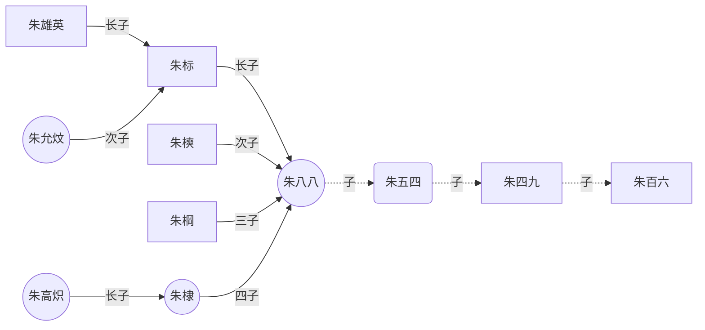

以上是概述，下面详细介绍饼状图和流程图的语法。其他图的语法可访问上文给出的项目地址，自行学习。（记得挂梯子）

# 饼状图

在线渲染器：[Online FlowChart & Diagrams Editor](https://mermaidjs.github.io/mermaid-live-editor/#/edit/eyJjb2RlIjoicGllXG5cIkRvZ3NcIiA6IDQyLjk2XG5cIkNhdHNcIiA6IDUwLjA1XG5cIlJhdHNcIiA6IDEwLjAxIiwibWVybWFpZCI6eyJ0aGVtZSI6ImRlZmF1bHQifX0)（需要梯子）

 语法
 
  - 从`pie`关键字开始图表
  - 然后使用`title`关键字及其在字符串中的值，为饼图赋予标题。（这是**可选的**）
  - 数据部分
    - 在`" "`内写上分区名。
    - 分区名后使用`:`作为分隔符
    - 分隔符后写上数值，最多支持2位小数——数据会以百分比的形式展示

* 实例

		pie
	    title 为什么总是宅在家里？
	    "喜欢宅" : 15
	    "天气太热或太冷" : 20
	    "穷" : 500


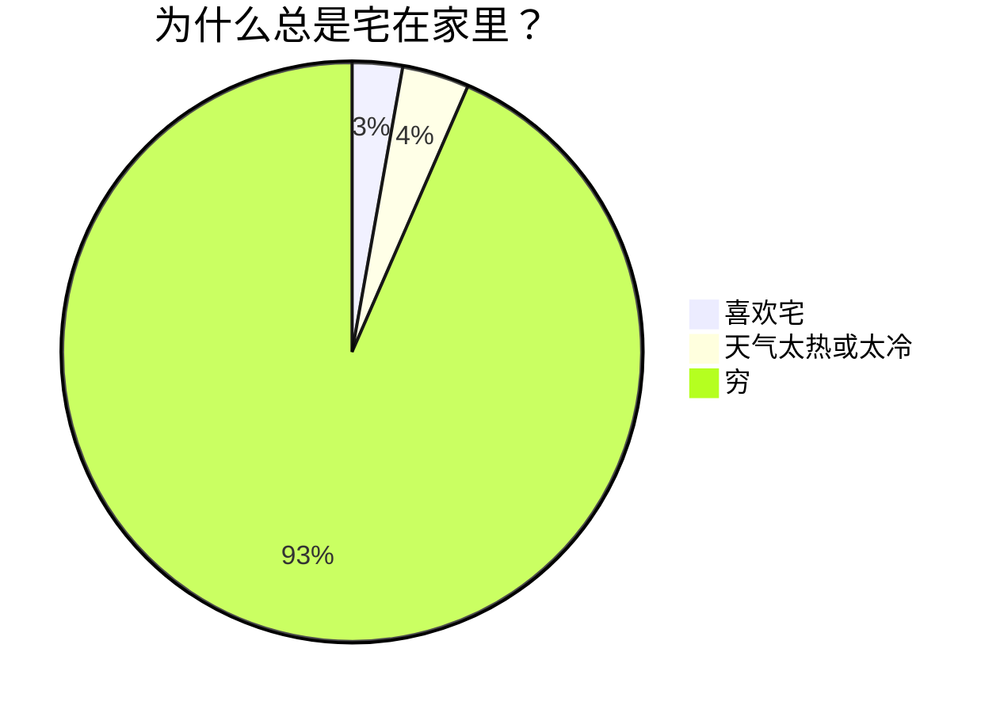

# 流程图

在线渲染器：[Online FlowChart & Diagrams Editor](https://mermaidjs.github.io/mermaid-live-editor/#/edit/eyJjb2RlIjoiZ3JhcGggVERcbiAgICBBW0hhcmRdIC0tPnxUZXh0fCBCKFJvdW5kKVxuICAgIEIgLS0-IEN7RGVjaXNpb259XG4gICAgQyAtLT58T25lfCBEW1Jlc3VsdCAxXVxuICAgIEMgLS0-fFR3b3wgRVtSZXN1bHQgMl0iLCJtZXJtYWlkIjp7InRoZW1lIjoiZGVmYXVsdCJ9fQ)（需要挂梯子）

## 实例
	graph LR
    A[Start] --> B{Is it?};
    B -- Yes --> C[OK];
    C --> D[Rethink];
    D --> B;
    B -- No ----> E[End];

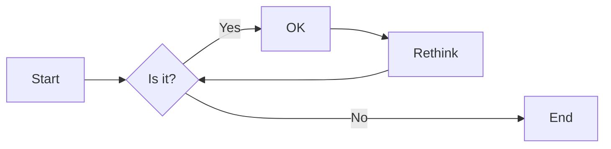

## 方向

用于开头，声明流程图的方向。

* `graph`或`graph TB`或`graph TD`：从上往下
* `graph BT`：从下往上
* `graph LR`：从左往右
* `graph RL`：从右往左

## 结点

* 无名字的结点：直接写内容，此时结点边框为方形；节点内容不能有空格
* 有名字的结点：节点名后书写内容，内容左右有特定符号，结点边框由符号决定；节点内容可以有空格

> 下面的实例中，没有为graph指定方向，因此默认是从上往下的。但是由于各个结点之前没有箭头，所以他们都处于同一排。

	graph
    默认方形
    id1[方形]
    id2(圆边矩形)
    id3([体育场形])
    id4[[子程序形]]
    id5[(圆柱形)]
    id6((圆形))
    
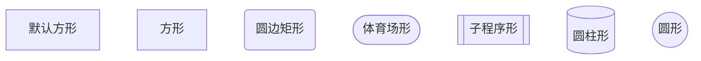
	graph
	id1{菱形}
	id2{{六角形}}
	id3[/平行四边形/]
	id4[\反向平行四边形\]
	id5[/梯形\]
	id6[\反向梯形/]
	
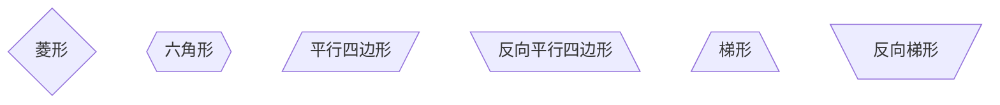

## 连线样式

* 实线箭头：分为无文本箭头和有文本箭头，有文本箭头有2种书写格式
	
		graph LR
		a-->b--文本1-->c-->|文本2|d

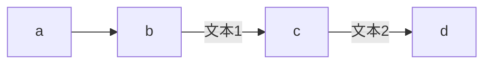

* 粗实线箭头：分为无文本箭头和有文本箭头

		graph LR
		a==>b==文本==>c

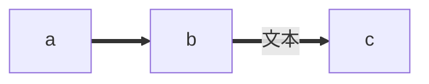

* 虚线箭头：分为无文本箭头和有文本箭头

		graph LR
		a-.->b-.文本.->c

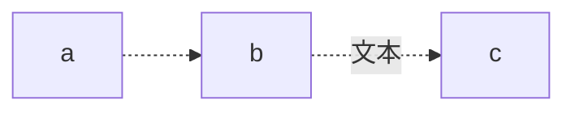

* 无箭头线：即以上三种连线去掉箭头后的形式

		graph LR
		a---b
		b--文本1---c
		c---|文本2|d
		d===e
		e==文本3===f
		f-.-g
		g-.文本.-h

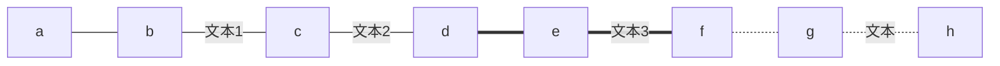

* 其他连线：需要将`graph`关键字改为`flowchart`，除了新增加的连线形式外，上面三种线的渲染效果也会不同

		flowchart LR
	    A o--o B
	    B <--> C
	    C x--x D
	    
	    旧连线 --文本--> 也会不同
	    
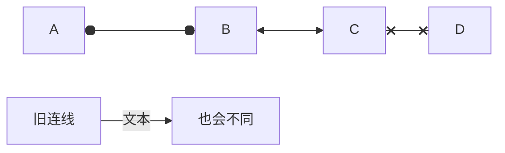

* 延长连线：增加相应字符即可，如下图中的B到E，连线中增加了一个`-`。字符可多次添加。

		graph LR
	    A[Start] --> B{Is it?};
	    B -->|Yes| C[OK];
	    C --> D[Rethink];
	    D --> B;
	    B --->|No| E[End];

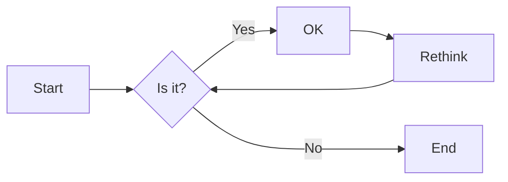


## 连线形式

* 直链

		graph LR
		A -- text --> B -- text2 --> C

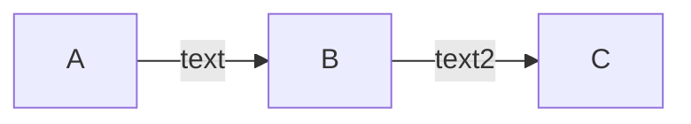

* 多重链：可以使用`&`字符，或单个描述

		graph 
		   a --> b & c--> d
		   
		   A & B--> C & D
		   
		    X --> M
		    X --> N
		    Y --> M
		    Y --> N

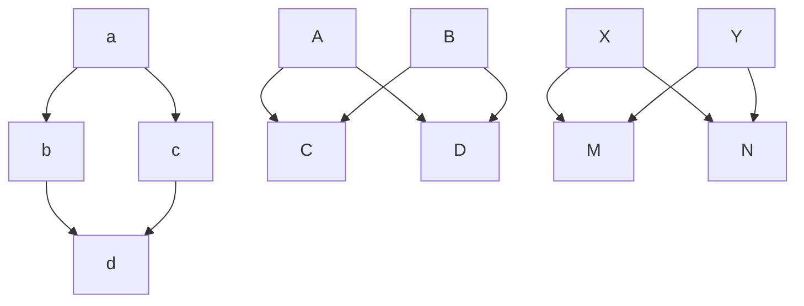

## 其他

* 子图：需要将`graph`关键字改为`flowchart`，在代码段的开始加入`subgraph`，尾部加入`end`

		flowchart TB
		    c1-->a2
		    subgraph one
		    a1-->a2
		    end
		    subgraph two
		    b1-->b2
		    end
		    subgraph three
		    c1-->c2
		    end
		    one --> two
		    three --> two
		    two --> c2

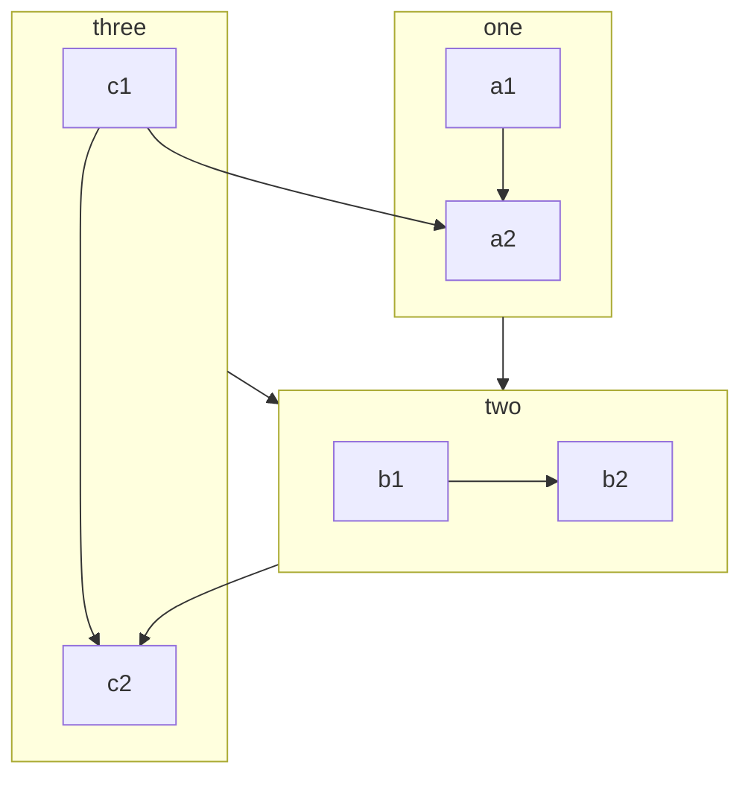

- 注释：在行首加入`%%`即可。

		graph LR
		%%这是一条注释，在渲染图中不可见
		    A[Hard edge] -->|Link text| B(Round edge)
		    B --> C{Decision}
		    C -->|One| D[Result one]
		    C -->|Two| E[Result two]
    
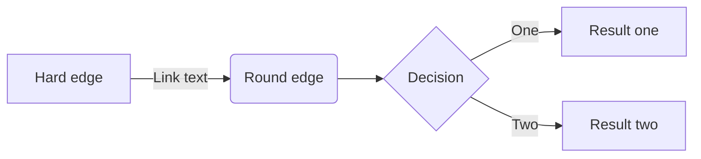


# 示例

## 1.Flowcharts

	graph LR
	A[Hard edge] -->|Link text| B(Round edge)
	B --> C{Decision}
	C -->|One| D[Result one]
	C -->|Two| E[Result two]


## 2.Sequence diagrams

	sequenceDiagram
		autonumber
		Alice->>John: Hello John, how are you?
		loop Healthcheck
			John->>John: Fight against hypochondria
		end
		Note right of John: Rational thoughts!
		John-->>Alice: Great!
		John->>Bob: How about you?
		Bob-->>John: Jolly good!

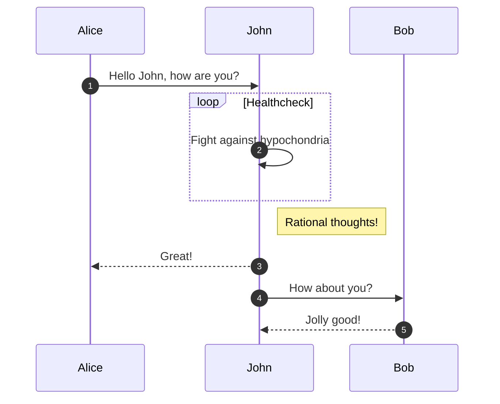

## 3.Class diagrams

		 classDiagram       
			 Animal <|-- Duck       
			 Animal <|-- Fish       
			 Animal <|-- Zebra       
			 Animal : +int age       
			 Animal : +String gender       
			 Animal: +isMammal()       
			 Animal: +mate()       
			 class Duck{           
				 +String beakColor           
				 +swim()           
				 +quack()       
			}       
			class Fish{           
					-int sizeInFeet           
					-canEat()       
			}       
			class Zebra{           
					+bool is_wild           
					+run()       
			}

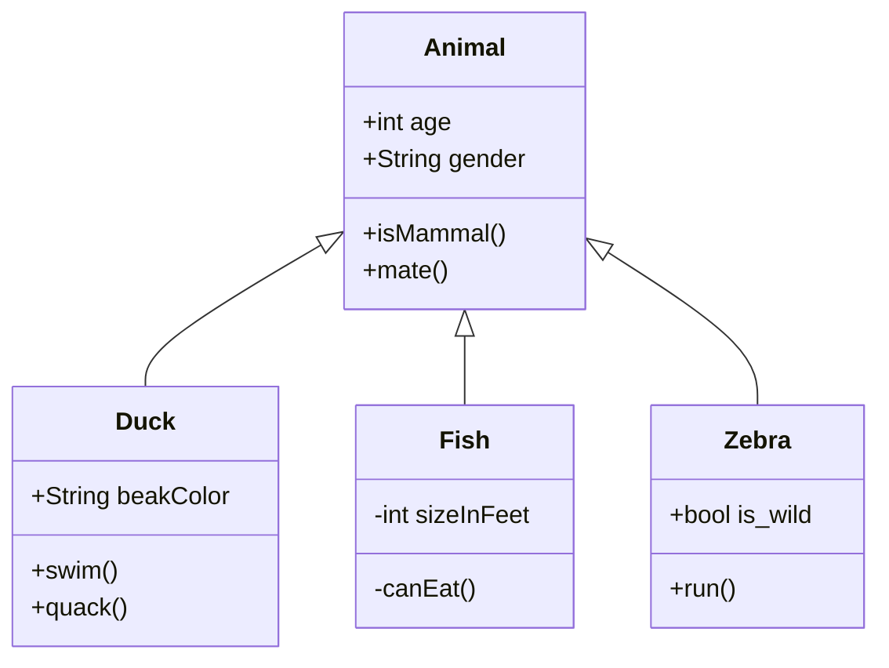

## 4.State diagrams

		stateDiagram-v2
			[*] --> First
			First --> Second
			First --> Third
			   
			state First {
				[*] --> fir
				fir --> [*]
			}
			
			state Second {
				[*] --> sec
				sec --> [*]
			}
			
			state Third {
				[*] --> thi
				thi --> [*]
			}

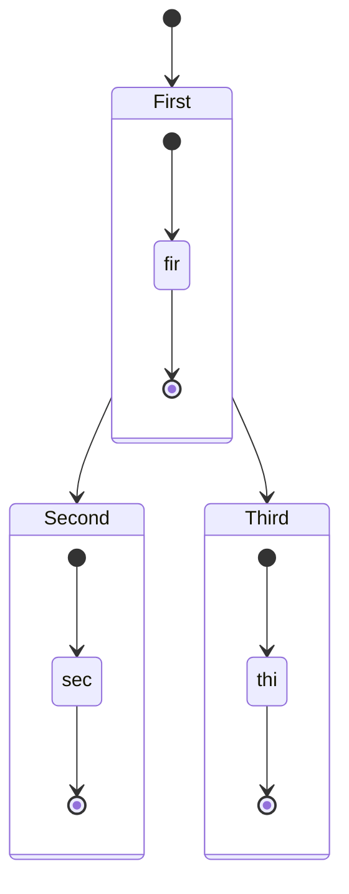

## 5.Entity Relationship Diagrams

	erDiagram
		CUSTOMER ||--o{ ORDER : places
		ORDER ||--|{ LINE-ITEM : contains
		CUSTOMER }|..|{ DELIVERY-ADDRESS : uses

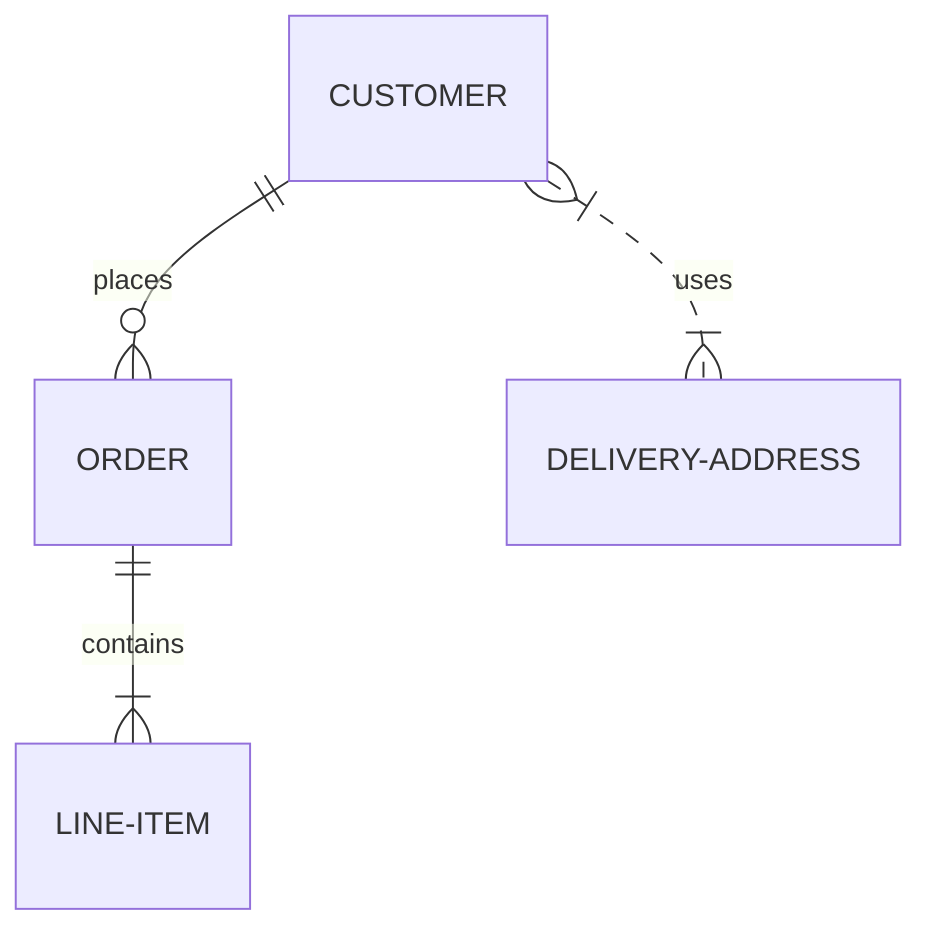

## 6.User Journey Diagram
		journey
		    title My working day
		    section Go to work
		      Make tea: 5: Me
		      Go upstairs: 3: Me
		      Do work: 1: Me, Cat
		    section Go home
		      Go downstairs: 5: Me
		      Sit down: 5: Me

```mermaid
journey
    title My working day
    section Go to work
      Make tea: 5: Me
      Go upstairs: 3: Me
      Do work: 1: Me, Cat
    section Go home
      Go downstairs: 5: Me
      Sit down: 5: Me
```

## 7.Gantt diagrams
		gantt
		    dateFormat  YYYY-MM-DD
		    title       Adding GANTT diagram functionality to mermaid
		    excludes    weekends
		    %% (`excludes` accepts specific dates in YYYY-MM-DD format, days of the week ("sunday") or "weekends", but not the word "weekdays".)
		
		    section A section
		    Completed task            :done,    des1, 2014-01-06,2014-01-08
		    Active task               :active,  des2, 2014-01-09, 3d
		    Future task               :         des3, after des2, 5d
		    Future task2              :         des4, after des3, 5d
		
		    section Critical tasks
		    Completed task in the critical line :crit, done, 2014-01-06,24h
		    Implement parser and jison          :crit, done, after des1, 2d
		    Create tests for parser             :crit, active, 3d
		    Future task in critical line        :crit, 5d
		    Create tests for renderer           :2d
		    Add to mermaid                      :1d
		
		    section Documentation
		    Describe gantt syntax               :active, a1, after des1, 3d
		    Add gantt diagram to demo page      :after a1  , 20h
		    Add another diagram to demo page    :doc1, after a1  , 48h
		
		    section Last section
		    Describe gantt syntax               :after doc1, 3d
		    Add gantt diagram to demo page      :20h
		    Add another diagram to demo page    :48h

```mermaid
gantt
    dateFormat  YYYY-MM-DD
    title       Adding GANTT diagram functionality to mermaid
    excludes    weekends
    %% (`excludes` accepts specific dates in YYYY-MM-DD format, days of the week ("sunday") or "weekends", but not the word "weekdays".)

    section A section
    Completed task            :done,    des1, 2014-01-06,2014-01-08
    Active task               :active,  des2, 2014-01-09, 3d
    Future task               :         des3, after des2, 5d
    Future task2              :         des4, after des3, 5d

    section Critical tasks
    Completed task in the critical line :crit, done, 2014-01-06,24h
    Implement parser and jison          :crit, done, after des1, 2d
    Create tests for parser             :crit, active, 3d
    Future task in critical line        :crit, 5d
    Create tests for renderer           :2d
    Add to mermaid                      :1d

    section Documentation
    Describe gantt syntax               :active, a1, after des1, 3d
    Add gantt diagram to demo page      :after a1  , 20h
    Add another diagram to demo page    :doc1, after a1  , 48h

    section Last section
    Describe gantt syntax               :after doc1, 3d
    Add gantt diagram to demo page      :20h
    Add another diagram to demo page    :48h
```

## 8.Pie chart diagrams
		pie title Pets adopted by volunteers
	    "Dogs" : 386
	    "Cats" : 85
	    "Rats" : 15

```mermaid
	pie title Pets adopted by volunteers
    "Dogs" : 386
    "Cats" : 85
    "Rats" : 15
```