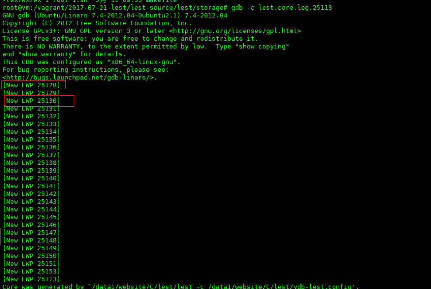
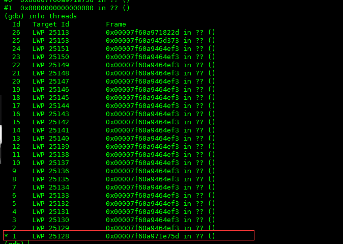
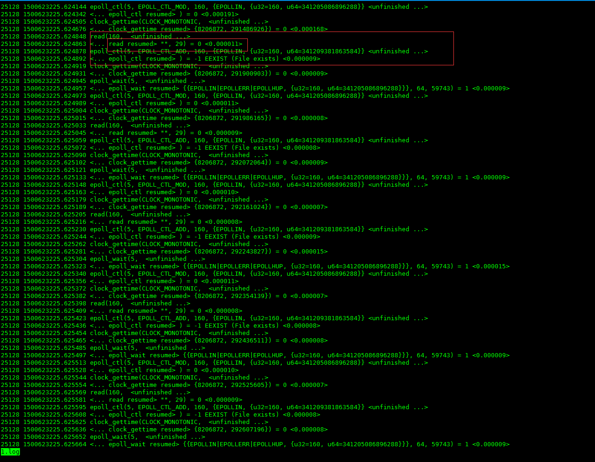
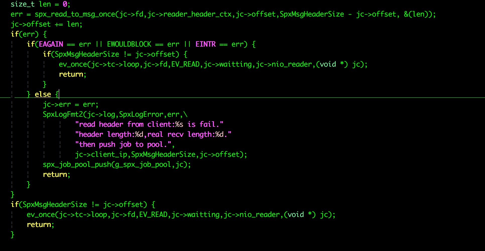
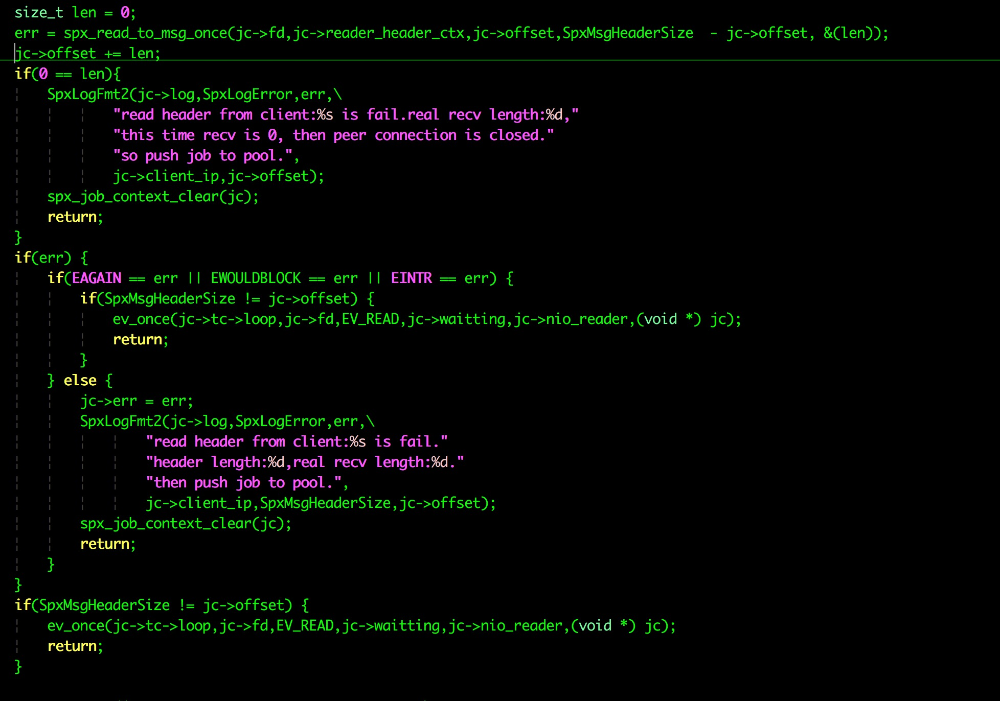

Title: 网络read函数未判返回0导致CPU 100%
Date: 2017-08-08
Category: 技术
Tags: 技术
Slug: read-api-rc-0
Author: spk xu
Status: published
Summary:这几天我们的服务器不太稳定,经常被运维找,表象就是cpu会跑着跑着就到100%了.

我们的“运维小帅哥”又来烦我们了！没事就在群里给我们post了一张图，如下：  

**新上线的lest系统的CPU使用率很高！**。一看才17%，不是正常吗？小帅哥爆发了，不对。这是多核，被平均的消耗！实际上两个核已经被吃满了！
## 检查服务器

使用top命令看了一下，如下图：  

从上图可以看到，cpu的load负载一直在2左右，也就是说其中的2个核已经被占满。再看下面，是被2个cpu沾满的！看一下CPU的情况，其中系统负载和用户负载几乎是一样的，一个是9.1%，另外一个是7.4%。这就是说可能的问题出在用户态，用户态因为需要调用系统调用，把系统的负载带起来了！那么造成这种疯狂消耗CPU的原因基本上99%都是在循环中干了什么傻事，导致循环出不来，疯狂的消耗CPU！    

因为是CPU负载比较高，不是什么内存泄露之类的问题，所以没办法通过core来精确的debug。我们只能靠gcore通过人工的方式强行抓取进程的runtimes碰碰运气，看看是不是能看出来一点蛛丝马迹。  

## debug，看runtimes

首先，加入core后得到的结果如下图：  

和上面top对应的是两个线程：25128和24130。因为问题就是出在它们身上，我们进入这2个线程看一下它们到底在做什么，首先看一下线程的编号，如下图：  

当前线程就是28这个，那就直接来吧，运行bt，如下图：  

和前面的几次一样都是啥都没有的？，还是使用%rbp来看一下吧，如下图：  

这是在读取数据，这个也是正常的调用，但是它是一个“可能的循环”。看上去没发现什么有价值的东西。那么进入到30这个线程看看，如下图：  

这个线程还是在stack的顶端，没在运行。也就是说可能在我们抓取core的一瞬间，此线程正好因为cpu的时间片被让出，啥都没在干。

到目前为止，通过gdb我们没有发现很多有价值的东西，除了那个疑似的可能性循环，但是就这点信息不能确定就是它的问题。也就是说从用户态入手，我们看不太到我们想要的信息，那我们看看系统调用的。  

## 再次求证

使用strace将所有线程的系统调用全部抓取出来，因为线程太多了，容易形成干扰，所以我们使用grep将怀疑有问题的25128线程给抓取出来，如下图：  

为了明确问题，我已经用红色的标记给标出来了！我们发现在整个的系统调用中，一直在循环的调用read，epoll_ctl，这样的函数。再仔细看一下，每次read都欲获取29长度的值（29是header的buffer长度），但是实际得到的长度是0，表示没有数据。也就是说，我们试图每次都获取数据，但每次都没有获取到数据，事件机制又把这个fd给重新加到了epoll中监听了。回忆上面core在gdb中的表现，28线程一直在read数据。那么问题就在这里了。因为没有给read进行合理的返回值过滤，导致错误的返回值也被按照正确对待，重新加入epoll监听，有因为epoll是一个无线循环，而每次又都触发read，所以轻轻松松的就干掉了CPU。

## 检查代码

回过头来检查代码，read的网络事件都是被组织在spx（是我们的一个c开发组件）中的，查看nio，如下图：

确实没有对read的真实获取长度（就是代码中的&len）为0的情况进行判断，所以发生了这个问题。解决办法也简单，将这个判断加上就可以了。，如下图：  

## 连带问题及其解决

解决问题，心里美滋滋的。上uat，观察一会儿！突然，我同事和我说，为什么fixed后的版本上传数据失败率有点高啊？多高？50%以上！我x。马上拿一个日志下来看看，如图：

哎呀，很多重试的链接都被强行关闭了。仔细看一下上面的代码，也就是说当spx_read_to_msg_once的err为EAGIN的时候，len也是0，但是代码却先判断了0==len，所以就“变向”过滤掉了err == EAGIN的情况。但是err == EAGIN的情况是正常的，应该被再次加入epoll重试，所以调整一下代码，将0 == len的判断移到判断err的后面，先判断err，就不会出现这种情况下了，代码更改如下：  

这样世界终于清静了！上uat，果然畅通，稳定后再上到online，看一下这个cpu的曲线：

在这个40°c的天气终于透心凉了！

## 问题引申

那么还有问题来了，为什么write数据的时候，如果返回值为0不需要判断呢？  
其实这个和tcpip的api有关。当read的时候，如果返回值是0，就表示对端已经关闭，所以后续没有数据读取了。write的时候，write的是本地的网络缓冲区，也就是滑动窗口，如果你的额client是一个慢client，读取你滑动窗口的数据特别慢，就会导致你write的时候数据写不进去，但是数据写不进去并不是一个错误，只是要你等client读取过后再试一次而已。所以write返回0加入epoll来使用事件触发是正确的。